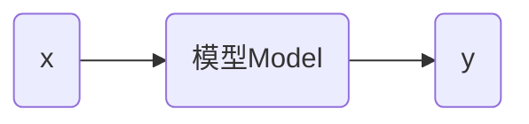
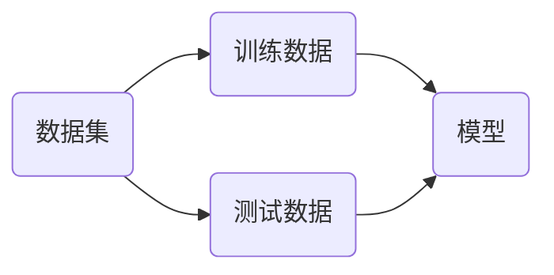

线性回归的意义


回归这个概念最早是由英国生物学家兼统计学家弗朗西斯·高尔顿（Francis Galton）提出的，意思是回归平均值（regression toward the mean）。高尔顿的学生卡尔・皮尔逊（Karl Pearson）将这一概念延伸到统计学。机器学习中借鉴了统计学的回归概念，产生了回归分析。


## 简单线性回归

汽车销量和汽车价格成线性关系。寻找一条直线，最大程度的拟合样本特征和监督数据之间的关系。

* 样本特征是汽车价格

* 监督数据是汽车销量


> [!warning]

> 

> 在上面例子中x轴价格是特征，y轴是监督数据。与KNN问题不同，KNN问题中x，y轴都表示特征。

**线性回归（linear regression）**：是一种统计分析方法，用于预测一个因变量的值，基于一个或多个自变量的值。它假设因变量和自变量之间存在线性关系。系数是需要通过数据拟合来确定的。

* 回归问题是预测一个具体的数值，数值是在连续的空间里。

* 对于样本特征只有一个的回归问题，称为简单线性回归。通过研究简单线性回归，可以理解线性回归的特性，从而推广到更高维度。

在二维平面中找到一条直线最大程度去拟合样本的分布，可以表示为数学公式：

$$
y=ax+b

$$

对于每一个样本点$x^{(i)}$，根据直线方程可以得到预测值

$$
\hat{y}^{(i)} = ax^{(i)}+b

$$

同时也存在着一个监督值$y^{(i)}$，在预测直线时，希望$y^{(i)}$和$\hat{y}^{(i)}$的差距尽量小，可以表示为

$$
y^{(i)}-\hat{y}^{(i)}

$$

但是差值有可能为正，也有可能能为负，所以可以使用

$$
\left | y^{(i)}-\hat{y}^{(i)} \right |

$$

由于上式不是一个处处可到的函数，在求极值时存在问题。所以可以使用

$$
\left ( y^{(i)}-\hat{y}^{(i)} \right )^2

$$

考虑到所有样本

$$
\sum_{i=1}^m \left ( y^{(i)}-\hat{y}^{(i)} \right )^2

$$

最佳拟合的目标就是使上式尽可能小，上式可以转化为

$$
\sum_{i=1}^m \left ( y^{(i)}-ax^{(i)}-b \right )^2 \tag{1}

$$

在上式中，$a$和$b$是未知数，$ y^{(i)}$和$x^{(i)}$​是已知数。

> [!warning]

> 

> 将上述问题，转化为一个求最小值问题，是典型的机器学习算法的思考方式。

函数 $(1)$ 称为**损失函数（loss function）**，用于度量模型**没有拟合**样本的程度（预测结果与实际结果之间差异）。如果目是度量样本**拟合**样本的程度，称为**效用函数（utility function）**。两者统称为**目标函数**。

机器学习的任务就是最优化这个目标函数，损失函数值越小越好，效用函数值越大越好。最终，得到一个机器学习模型。几乎所有**参数学习**的方法，都遵循上面的思路

* 参数学习：假设模型拥有固定数量参数的学习方法。

* 非参数学习：参数数量随着数据规模的增长，而变化的学习方法。KNN属于非参数学习。

函数 $(1)$ 是典型的最小二乘法问题（最小化平方误差）。求函数 $(1)$ 的最小值可以转化为就函数的极值，而极值存在的点是导数等于0的点。最终可以解得

$$
a = \frac{\sum_{i=1}^{m}\left ( x^{(i)}- \bar x \right)\left ( y^{(i)}- \bar y \right)}{\sum_{i=1}^{m}\left ( x^{(i)}- \bar x \right)^2} \qquad

b=\bar y - a \bar x

$$

> [!note]

> 

> 为什么要使用线性模型来拟合已有的值？

这里的直线$y=ax+b$就可以理解为模型



### 简单线性回归的实现

有汽车销售数据，其中`x`是价格（单位：万元），`y`是汽车销量（单位：千量）

```python
import matplotlib.pyplot as plt


x = [9, 9.23, 9.41, 9.68, 9.98, 10.20, 10.58, 10.68, 10.88, 10.98, 11.28, 11.38, 11.56, 11.88, 12.00]

y = [12.23, 11.7, 10.21, 9.60, 8.72, 7.70, 7.10, 6.61, 6.10, 5.82, 5.50, 5.23, 4.65, 4.20, 3.50]


plt.figure(figsize=(10, 8))

plt.scatter(x, y, s=120)

plt.xticks(fontsize=16)

plt.yticks(fontsize=16)

plt.show()
```

根据公式可以求出$a$和$b$的值。

```python
import numpy as np


x_mean = np.mean(x)

y_mean = np.mean(y)


num = 0.0

d = 0.0


for x_i, y_i in zip(x, y):

num += (x_i - x_mean) * (y_i - y_mean)

d += (x_i - x_mean) ** 2

a = num / d

b = y_mean - a * x_mean


print(f'a = {a}, b = {b}')
```

根据$a$和$b$的值可以绘制估计曲线

```python
y_hat = a * x + b


plt.figure(figsize=(10, 8))

plt.scatter(x, y, s=120)

plt.plot(x, y_hat, color='r', linewidth=3)

plt.xticks(fontsize=16)

plt.yticks(fontsize=16)

plt.show()
```

可以得到的模型来预测未知值

```python
x_predict = 8

y_predict = a * x_predict + b

print(y_predict)
```

可以将上面的算法过程封装层一个类

```python
class SimpleLinearRegression:

def __init__(self):

self.a_ = None

self.b_ = None

def fit(self, x_train, y_train):

assert x_train.ndim == 1, 'Simple Linear Regression can only solve single feature training data.'

assert len(x_train) == len(y_train), 'The size of x_train must be equal to the size of y_train.'

x_mean = np.mean(x_train)

y_mean = np.mean(y_train)

num = 0.0

d = 0.0

for x_i, y_i in zip(x_train, y_train):

num += (x_i - x_mean) * (y_i - y_mean)

d += (x_i - x_mean) ** 2

self.a_ = num / d

self.b_ = y_mean - self.a_ * x_mean

return self

def predict(self, x_predict):

assert x_predict.ndim == 1, 'Simple Linear Regression can only solve single feature training data.'

assert self.a_ is not None and self.b_ is not None, 'Must fit before predict.'

return np.array([self._predict(x) for x in x_predict])

def _predict(self, x_single):

return self.a_ * x_single + self.b_
```

使用自己定义的算法类

```py
reg = SimpleLinearRegression()

reg.fit(x, y)

print(f'a = {reg.a_}, b = {reg.b_}')

print(reg.predict(np.array([x_predict])))
```

### 向量化计算

计算参数$a$和$b$的值，主要依据的公式是

$$
a = \frac{\sum_{i=1}^{m}\left ( x^{(i)}- \bar x \right)\left ( y^{(i)}- \bar y \right)}{\sum_{i=1}^{m}\left ( x^{(i)}- \bar x \right)^2} \qquad \tag{2}

$$

考虑如下的公式

$$
\sum_{i=1}^{m} w^{(i)} v^{(i)} \tag{3}

$$

其中

$$
\begin{cases}

w = \left( w^{(1)}, w^{(2)},……, w^{(m)}\right) \\

v = \left( v^{(1)}, v^{(2)},……, v^{(m)}\right)

\end{cases}

$$

所以公式 $(3)$ 可以表示文

$$
w \cdot v

$$

所以公式 $(2)$ 可以使用numpy中的向量化计算，而不是用循环来实现。

```python
class SimpleLinearRegressionPro:

def __init__(self):

self.a_ = None

self.b_ = None

def fit(self, x_train, y_train):

assert x_train.ndim == 1, 'Simple Linear Regression can only solve single feature training data.'

assert len(x_train) == len(y_train), 'The size of x_train must be equal to the size of y_train.'

x_mean = np.mean(x_train)

y_mean = np.mean(y_train)

num = (x_train - x_mean).dot(y_train - y_mean)

d = (x_train - x_mean).dot(x_train - x_mean)

self.a_ = num / d

self.b_ = y_mean - self.a_ * x_mean

return self

def predict(self, x_predict):

assert x_predict.ndim == 1, 'Simple Linear Regression can only solve single feature training data.'

assert self.a_ is not None and self.b_ is not None, 'Must fit before predict.'

return np.array([self._predict(x) for x in x_predict])

def _predict(self, x_single):

return self.a_ * x_single + self.b_

reg_pro = SimpleLinearRegressionPro()

reg_pro.fit(x, y)

print(f'a = {reg_pro.a_}, b = {reg_pro.b_}')
```

可以分别测试一下算法的性能

```python
m = 1000000

big_x = np.random.random(size=m)

big_y = big_x * 2.0 + 3.0 + np.random.normal(size=m)

%timeit reg.fit(big_x, big_y)

%timeit reg_pro.fit(big_x, big_y)
```

根据拟合结果，观察拟合的参数

```python
print(f'a = {reg.a_}, b = {reg.b_}')

print(f'a = {reg_pro.a_}, b = {reg_pro.b_}')
```

## 多元线性回归

在真实世界中描述一个样本，会有很多的特征值，对于这样的问题也可以使用线性回归的方法来解决，这就是多元线性回归。


当样本点由多个特征表示时

$$
X^{(i)}= \left( X_1^{(i)}, X_2^{(i)},……,X_n^{(i)} \right)

$$

多元线性回归公式可以表示为

$$
y=w_0+w_1x_1+w_2x_2+……+w_nx_n

$$

在简单线性回归中$b$等价于$w_0$，$a$等价于$w_1$。如何可以学习出响应的参数，对于样本$i$可以求出预测值

$$
\hat{y}^{(i)} =w_0+w_1X_1^{(i)}+w_2X_2^{(i)}+……+w_nX_n^{(i)} \tag{5}

$$

上式中同样可以使用目标函数

$$
\sum_{i=1}^m \left ( y^{(i)}-\hat{y}^{(i)} \right )^2 \tag{6}

$$

所以，多元线性回归就是找到使上面的目标函数最小的一组$(w_0, w_1, ……, w_n)$​。定义

$$
w=\left(w_0, w_1, ……, w_n\right)^T

$$

将公式 $(5)$ 转化为

$$
\hat{y}^{(i)} =w_0X_0^{(i)}+w_1X_1^{(i)}+w_2X_2^{(i)}+……+w_nX_n^{(i)} \tag{7}

$$

其中$X_0^{(i)}\equiv 1 $，可以得到

$$
X^{(i)}_b= \left( X_0^{(i)}, X_1^{(i)}, X_2^{(i)},……,X_n^{(i)} \right)

$$

公式 $(7)$ 可以表示为

$$
\hat{y}^{(i)} =X^{(i)}_b \cdot w

$$

即计算两个向量的内积，得到一个数。对于所有的样本数据存在

$$
X_b=

\begin{pmatrix}

1 & X_1^{(1)} & X_2^{(1)} & \cdots & X_n^{(1)} \\

1 & X_1^{(2)} & X_2^{(2)} & \cdots & X_n^{(2)} \\

\vdots & \vdots & \vdots & \ddots & \vdots \\

1 & X_1^{(m)} & X_2^{(m)} & \cdots & X_n^{(m)} \\

\end{pmatrix}

$$

同时$w$可以表示为

$$
w =

\begin{pmatrix}

w_0 \\

w_1 \\

… \\

w_n

\end{pmatrix} \tag{8}

$$

在公式 $(8)$中$w_0$称为截距（intercept），$\left(w_1, ……, w_n\right)^T$称为系数（coefficient），系数在一定程度上反应了特征的重要性，而截距没有这一特征。预测值的计算可以表示为矩阵运算

$$
\hat{y}=X_b \cdot w

$$

公式 $(6)$ 目标函数可以表示为

$$
\left ( y- X_b \cdot w \right )^T\left ( y- X_b \cdot w \right )

$$

使得上述公式最小的$w$可以表示为

$$
w=\left ( X_b^T X_b \right )^{-1}X_b^Ty

$$

上述公式称为多元线性回归的正规方程解（Normal Equation），但是上述结果求解的时间复杂度为$O(n^3)$（优化后可达到$O(n^{2.4})$）。

[糖尿病数据集](https://scikit-learn.org/stable/datasets/toy_dataset.html#diabetes-dataset)是sklearn中进行，回归实验的数据集，包含：年龄、性别、平均血压等10个特征。需要估计的是一年疾病进展的定量测量。

```python
from sklearn import datasets

diabetes = datasets.load_diabetes(scaled=False)

print(diabetes.DESCR)
```

`scaled=False`表示数据不需要归一化。

```python
x = diabetes.data

y = diabetes.target


print(x[:5])

print(y[:5])
```

将数据划分为训练集和测试集

```python
from sklearn.model_selection import train_test_split


x_train, x_test, y_train, y_test = train_test_split(x, y, test_size=0.2, random_state=42)

print(x_train.shape)

print(x_test.shape)
```

在sklearn中使用多元线性回归

```python
from sklearn.linear_model import LinearRegression


lin_reg = LinearRegression()

lin_reg.fit(x_train, y_train)

print(lin_reg.intercept_)

print(lin_reg.coef_)

print(lin_reg.score(x_test, y_test))
```

`LinearRegression`默认通过正规方程求解，适合中小规模数据集。

## 评价指标

> [!note]

> 

> 如何评价回归算法的性能？

线性回归算法的目标就是找$a$和$b$的值，使函数 $(1)$ 尽可能小。在回归算法中，也需要将原始数据集分为**训练数据集**和**测试数据集**两部分。在训练过程中使函数 $(1)$ 尽可能小，是针对训练数据集来说，所以可以表示为：

$$
\sum_{i=1}^m \left ( y^{(i)}_{train}-\hat{y}^{(i)}_{train} \right )^2

$$

根据拟合出$a$和$b$​的值，可以计算出测试数据集：

$$
\hat{y}^{(i)}_{test} = ax^{(i)}_{test}+b

$$

所以可以根据

$$
\sum_{i=1}^m \left ( y^{(i)}_{test}-\hat{y}^{(i)}_{test} \right )^2

$$

的结果，作为衡量算法性能的标准，但是上述结果与数据量（$m$值）相关。所以可以使用如下公式作为衡量标准

$$
\text{MSE}_{test}=\frac{1}{m}\sum_{i=1}^m \left ( y^{(i)}_{test}-\hat{y}^{(i)}_{test} \right )^2

$$

其中MSE（Mean Squared Error）是均方误差。MSE 的值**只有相对意义，没有绝对意义**。只是用例比较同一数据类型间的关系。以MSE作为标准，误差的量纲会发生变化，所以开方可以得到

$$
\text{RMSE}_{test}=\sqrt{\text{MSE}_{test}}=\sqrt{\frac{1}{m}\sum_{i=1}^m \left ( y^{(i)}_{test}-\hat{y}^{(i)}_{test} \right )^2}

$$

上式的评价标准称为均方根误差（Root Mean Square Error）。对于回归算法还可以采用如下公式

$$
\text{MAE}_{test}=\frac{1}{m}\sum_{i=1}^m \left | y^{(i)}_{test}-\hat{y}^{(i)}_{test} \right |

$$

作为评价标，其中MAE（Mean Absolute Error）平均绝对误差。

> [!warning]

> 

> 在机器学习算法中，目标函数和评价标准的函数可完全不一致。

sklearn中MSE、RMSE和MAE的计算

```python
from sklearn.metrics import mean_squared_error, root_mean_squared_error, mean_absolute_error


y_predict = reg.predict(x_test)

mse = mean_squared_error(y_test, y_predict)

print(mse)

rmse = root_mean_squared_error(y_test, y_predict)

print(rmse)

mae = mean_absolute_error(y_test, y_predict)

print(mae)
```

> [!note]

> 

> 为什么RMSE的值要大于MAE，这两个评价标准哪个更有价值。

### 判定系数

考虑到不同任务中，MSE和MAE的波动浮动不同，需要找到一个评价标准可以绝对意义上表示算法的优劣程度。判定系数（Coefficient of Determination）计算公式如下。

$$
R^2=1-\frac{SS_{residual}}{SS_{total}}=1-\frac{\sum_{i=1}^m \left ( \hat{y}^{(i)} -y^{(i)} \right )^2}{\sum_{i=1}^m \left ( \bar{y} -y^{(i)} \right )^2} \tag{4}

$$

公式 $(4)$ 中，分子表示模型预测的偏差，分母表示真实值与均值的偏差，**这个值可以理解为基准模型**，所以上式可以理解为模型拟合的一些结果，即没有产生错误的指标。公式 $(4)$ 还可以表示为

$$
1R^2=1-\frac{ \frac{1}{m} \sum_{i=1}^m \left ( \hat{y}^{(i)} -y^{(i)} \right )^2}{\frac{1}{m}\sum_{i=1}^m \left ( y^{(i)} -\bar{y} \right )^2}=1-\frac{\text{MSE}}{\text{Var}}

$$

* $R^2 \le 1$​

* $R^2$越大越好。当预测全部正确时，$R^2=1$取得最大值。

* $R^2=0$说明模型等于基准模型。

* $R^2 \le 0$​​说明模型还不如基准模型，很可能数据不存在任何线性关系。

```python
print(1 - mean_squared_error(y_test, y_predict) / np.var(y_test))
```

sklearn中$R^2$的计算

```python
from sklearn.metrics import r2_score


print(r2_score(y_test, y_predict))
```

## 关于线性回归

使用全部数据进行预测

```python
lin_reg.score(x, y)

lin_reg.fit(x, y)

print(lin_reg.intercept_)

print(lin_reg.coef_)
```

从`coef_`的结果可以看出$w_i$​有正有负，正数表示预测结果与特征正相关，负数表示特征与预测结果负相关。将特征**由小到大排序**。

```python
index = np.argsort(lin_reg.coef_)

names = np.array(diabetes.feature_names)

print(index)

print(names[np.argsort(index)])

print(diabetes.DESCR)
```

> [!warning]

> 

> 线性回归具有强可解释性。

线性回归的模型可以表示为

$$
y=w^Tx

$$

其中$w$由公式 $(8)$ 表示。

> [!attention]

> 

> 线性回归假设，数据和结果之间存在线性关系，这种线性关系包括正相关和负相关。在高维空间中线性相关，不能简单的理解为平面中的直线。

### KNN回归分析

使用KNN算法对数据进行回归分析

```python
from sklearn.neighbors import KNeighborsRegressor


knn_reg = KNeighborsRegressor()

knn_reg.fit(x_train, y_train)

print(knn_reg.score(x_test, y_test))
```

# 梯度下降法

梯度下降法（Gradient Descent）是一种，用于优化目标函数的**迭代算法**。

* 是一种基于搜索的最优化方法。

* 最小化损失函数（最大化效用函使用梯度上升法）。


对于简单线性回归来说，损失函数如下：

$$
\sum_{i=1}^m \left ( y^{(i)}-ax^{(i)}-b \right )^2

$$

函数中$a$和$b$是变量，由于$b$是一个偏移量，考虑与特征相关的变量只有$a$，所以损失函数可以表示为

$$
L=f(\theta)

$$

对于只有一个参数的损失函数图像如下


纵坐标表示损失函数$L$的值，横坐标表示系数$\theta$。每一个$\theta$值都会对应一个损失函数$L$的值，使损失函数$L$​最小，就是找到曲线的最小值点。


对于曲线上任意一点A，直线M是点A的切线，A的导数就是直线M的斜率，切线的斜率即为导数的符号。而导数的正负，可以指出损失函数$L$增加的方向。

* 如果 $\frac{\mathrm{d} L}{\mathrm{d} \theta } >0 $，沿横坐标正方向上损失函数值增大。

* 如果 $\frac{\mathrm{d} L}{\mathrm{d} \theta } <0 $，沿横坐标负方向上损失函数值增大。

对于任意一点A的取值其横坐标为$\theta_1$，对应的损失函数值为$L(\theta_1)$​，对改点的损失函数值，加一个导数值，则有

$$
\theta_1 + {L}' (\theta_1)

$$

可以看出，增加一个导数值后，损失函数是在增加的，如果希望损失函数值不断变小，需要在$\theta_1$的基础上减小一个导数值，则有

$$
\theta_1 - \eta {L}' (\theta_1)

$$

上式在移动过程中增加了一个比例参数$\eta$，可以更好的控制移动的幅度，


$\theta_1$减小后移动到$\theta_2$的位置，可以看出损失函数在减小，但是并没有达到极值点，因为B点的导数也不为0。在$\theta_2$的基础上继续减小系数，可以得到


通过迭代可以找到损失函数的极小值，在上面的曲线中，极小值就是最小值。

$\eta$在机器学习中称为学习率：

* $\eta$​的取值影响获得最优解的速度。

* $\eta$​取值不合适时甚至得不到最优解。

* $\eta$是梯度下降法的一个超参数。


$\eta$过小学习的收敛速度慢。


$\eta$​过大导致不收敛。


不是所有函数都有唯一的极值点，所有梯度下线法收敛的点不一定都是最小值点。


解决方法时，随机初始化起始点，多次运行。梯度下降法的初始点也是一个超参数。对于简单线性回归的损失函数具有唯一的最优解。

## 模拟梯度下降法

模拟损失函数曲线

```python
import numpy as np

import matplotlib.pyplot as plt


plot_x = np.linspace(-1, 6, 141)

plot_y = (plot_x - 2.5) ** 2 - 1

plt.plot(plot_x, plot_y)

plt.show()
```

使用梯度下降法求最小值，绘制求解过程中的$\theta$取值。

```python
def dJ(theta):

return 2 * (theta - 2.5)


def J(theta):

return (theta - 2.5) ** 2 - 1


theta_history = []

def gradient_descent(initial_theta, eta, epsilon=1e-8):

theta = initial_theta

theta_history.append(initial_theta)

while True:

gradient = dJ(theta)

last_theta = theta

theta = theta - eta * gradient

theta_history.append(theta)

if abs(J(theta) - J(last_theta)) < epsilon:

break

return theta


def plot_theta_history():

plt.figure(figsize=(10, 8))

plt.plot(plot_x, J(plot_x))

plt.plot(np.array(theta_history), J(np.array(theta_history)), color='r', marker='+')

plt.xticks(fontsize=16)

plt.yticks(fontsize=16)

plt.show()
```

当$\eta$变小时

```python
eta = 0.01

theta_history = []

gradient_descent(0., eta)

plot_theta_history()
```

当$\eta$变大时

```python
eta = 0.8

theta_history = []

gradient_descent(0., eta)

plot_theta_history()
```

> [!warning]

> 

> $\eta$的取值与求导结果有关，$\eta$可以采用网格搜索的方法，经验值一般取0.01

## 线性回归中的梯度下降法

对于一般的线性回归公式

$$
\theta=\left( \theta_0, \theta_1, \cdots,\theta_n \right)

$$

梯度下降的表达式为

$$
-\eta\nabla L \qquad

\nabla L = \left( \frac{\partial L}{\partial \theta_0} , \frac{\partial L}{\partial \theta_1} , \cdots,\frac{\partial L}{\partial \theta_n} \right)

$$

其中$\nabla L$称为梯度值。在高维空间中，使用梯度代替导数，来移动$\theta$的值以便找到最小值点。对于有两个参数的梯度下降法示意图如下


> [!warning]

> 

> 梯度的几何意义是函数在该点增长最快的方向，其反方向是下降最快的方向。这是梯度下降法，将梯度作为$\theta$下降方向的原因。

损失函数为

$$
\sum_{i=1}^m \left ( y^{(i)}-\hat{y}^{(i)} \right )^2

$$

对于高维向量其中

$$
\hat{y}^{(i)}=\theta_0+\theta_1x_1^{(i)}+\theta_2x_2^{(i)}+\cdots+\theta_nx_n^{(i)}

$$

所有目标函数转换为

$$
\sum_{i=1}^m \left ( y^{(i)}-\theta_0-\theta_1x_1^{(i)}-\theta_2x_2^{(i)}-\cdots-\theta_nx_n^{(i)} \right )^2

$$

上式就是损失函数$L$，其中

$$
\hat{y}^{(i)} =X^{(i)}_b \cdot \theta

$$

所以$\nabla L$，可以表示为

$$
\nabla L(\theta) = \begin{pmatrix}

\frac{\partial L}{\partial \theta_0 } \\

\frac{\partial L}{\partial \theta_1 } \\

\frac{\partial L}{\partial \theta_2 } \\

\cdots \\

\frac{\partial L}{\partial \theta_n }

\end{pmatrix} = \begin{pmatrix}

\sum_{i=1}^m 2\left ( y^{(i)}-X_b^{(i)}\theta \right )(-1) \\

\sum_{i=1}^m 2\left ( y^{(i)}-X_b^{(i)}\theta \right )(-x_1^{(i)}) \\

\sum_{i=1}^m 2\left ( y^{(i)}-X_b^{(i)}\theta \right )(-x_2^{(i)}) \\

\cdots \\

\sum_{i=1}^m 2\left ( y^{(i)}-X_b^{(i)}\theta \right )(-x_n^{(i)})


\end{pmatrix}=2\begin{pmatrix}

\sum_{i=1}^m \left ( X_b^{(i)}\theta - y^{(i)} \right ) \\

\sum_{i=1}^m \left ( X_b^{(i)}\theta - y^{(i)} \right )x_1^{(i)} \\

\sum_{i=1}^m \left ( X_b^{(i)}\theta - y^{(i)} \right )x_2^{(i)} \\

\cdots \\

\sum_{i=1}^m \left ( X_b^{(i)}\theta - y^{(i)} \right )x_n^{(i)}


\end{pmatrix}

$$

上式中梯度计算与$m$相关，为了使梯度计算与$m$无关，则目标函数可以转换为

$$
\frac{1}{m}\sum_{i=1}^m \left ( y^{(i)}-\hat{y}^{(i)} \right )^2

$$

所以梯度计算可以表示为

$$
\nabla L(\theta) = \begin{pmatrix}

\frac{\partial L}{\partial \theta_0 } \\

\frac{\partial L}{\partial \theta_1 } \\

\frac{\partial L}{\partial \theta_2 } \\

\cdots \\

\frac{\partial L}{\partial \theta_n }

\end{pmatrix} =\frac{2}{m}\begin{pmatrix}

\sum_{i=1}^m \left ( X_b^{(i)}\theta - y^{(i)} \right ) \\

\sum_{i=1}^m \left ( X_b^{(i)}\theta - y^{(i)} \right )x_1^{(i)} \\

\sum_{i=1}^m \left ( X_b^{(i)}\theta - y^{(i)} \right )x_2^{(i)} \\

\cdots \\

\sum_{i=1}^m \left ( X_b^{(i)}\theta - y^{(i)} \right )x_n^{(i)}


\end{pmatrix}

$$

所以目标函数可以定义为

$$
L(\theta)=MSE(y,\hat{y})

$$

### 使用梯度计算线性回归

汽车销售数据如下

```python
x = [9, 9.23, 9.41, 9.68, 9.98, 10.20, 10.58, 10.68, 10.88, 10.98, 11.28, 11.38, 11.56, 11.88, 12.00]

y = [12.23, 11.7, 10.21, 9.60, 8.72, 7.70, 7.10, 6.61, 6.10, 5.82, 5.50, 5.23, 4.65, 4.20, 3.50]


x = np.array(x)

y = np.array(y)


plt.figure(figsize=(10, 8))

plt.scatter(x, y, s=120)

plt.xticks(fontsize=16)

plt.yticks(fontsize=16)

plt.show()
```

使用梯度下降算法训练参数

```python
def J(theta, X_b, y):

try:

return np.sum((y - X_b.dot(theta)) ** 2) / len(y)

except:

return float('inf')

def dJ(theta, X_b, y):

res = np.empty(len(theta))

res[0] = np.sum(X_b.dot(theta) - y)

for i in range(1, len(theta)):

res[i] = (X_b.dot(theta) - y).dot(X_b[:, i])

return res * 2 / len(X_b)


def gradient_descent(X_b, y, initial_theta, eta, n_iters=1e8, epsilon=1e-8):

theta = initial_theta

cur_iter = 0

while cur_iter < n_iters:

gradient = dJ(theta, X_b, y)

last_theta = theta

theta = theta - eta * gradient

if abs(J(theta, X_b, y) - J(last_theta, X_b, y)) < epsilon:

break

cur_iter += 1

return theta
```

使用梯度下降法，计算参数

```python
X = x.reshape(-1, 1)


X_b = np.hstack([np.ones((len(X), 1)), X])

initial_theta = np.zeros(X_b.shape[1])

eta = 0.007


theta = gradient_descent(X_b, y, initial_theta, eta)

print(theta)
```

梯度下降的计算过程


### 向量化计算

对于导数的计算

$$
\nabla L(\theta) = \frac{2}{m}\begin{pmatrix}

\sum_{i=1}^m \left ( X_b^{(i)}\theta - y^{(i)} \right ) \\

\sum_{i=1}^m \left ( X_b^{(i)}\theta - y^{(i)} \right )x_1^{(i)} \\

\sum_{i=1}^m \left ( X_b^{(i)}\theta - y^{(i)} \right )x_2^{(i)} \\

\cdots \\

\sum_{i=1}^m \left ( X_b^{(i)}\theta - y^{(i)} \right )x_n^{(i)}

\end{pmatrix} = \frac{2}{m}\begin{pmatrix}

\sum_{i=1}^m \left ( X_b^{(i)}\theta - y^{(i)} \right )x_0^{(i)} \\

\sum_{i=1}^m \left ( X_b^{(i)}\theta - y^{(i)} \right )x_1^{(i)} \\

\sum_{i=1}^m \left ( X_b^{(i)}\theta - y^{(i)} \right )x_2^{(i)} \\

\cdots \\

\sum_{i=1}^m \left ( X_b^{(i)}\theta - y^{(i)} \right )x_n^{(i)}

\end{pmatrix} \tag{1}

$$

其中$x_0^{(i)}\equiv 1 $，所以上式可以整理成

$$
\nabla L(\theta) = \frac{2}{m}\left( X_b^{(1)}\theta - y^{(1)}, X_b^{(2)}\theta - y^{(2)}, \cdots, X_b^{(m)}\theta - y^{(m)} \right) \cdot \begin{pmatrix}

x_0^{(1)}, x_1^{(1)}, \cdots ,x_n^{(1)} \\

x_0^{(2)}, x_1^{(2)}, \cdots ,x_n^{(2)} \\

\cdots \\

x_0^{(m)}, x_1^{(m)}, \cdots ,x_n^{(m)} \\

\end{pmatrix}

$$

后面的矩阵就是$X_b$，所以上式还可以写为

$$
\nabla L(\theta) = \frac{2}{m}\left( X_b \theta -y \right)^T \cdot X_b

$$

由于上述算式是一个行向量，所以为了保证计算结果是列向量，使用如下算式

$$
\frac{2}{m}X_b^T \cdot \left( X_b \theta -y \right)

$$

上面的梯度计算代码简化并封装如下：

```python
def fit_gd(X_train, y_train, eta=0.01, n_iters=1e4):

assert X_train.shape[0] == y_train.shape[0], 'the size of X_train must be equal to the size of y_train'

def J(theta, X_b, y):

try:

return np.sum((y - X_b.dot(theta)) ** 2) / len(y)

except:

return float('inf')

def dJ(theta, X_b, y):

return X_b.T.dot(X_b.dot(theta) - y) * 2. / len(y)

def gradient_descent(X_b, y, initial_theta, eta, n_iters=1e4, epsilon=1e-8):

theta = initial_theta

cur_iter = 0

while cur_iter < n_iters:

gradient = dJ(theta, X_b, y)

last_theta = theta

theta = theta - eta * gradient

if abs(J(theta, X_b, y) - J(last_theta, X_b, y)) < epsilon:

break

cur_iter += 1

return theta

X_b = np.hstack([np.ones((len(X_train), 1)), X_train])

initial_theta = np.zeros(X_b.shape[1])

theta = gradient_descent(X_b, y_train, initial_theta, eta, n_iters)

return theta
```

使用梯度下降法计算参数

```python
theta = fit_gd(X, y, eta=0.007)

print(theta)
```

## 随机梯度下降法

计算梯度的过程中，对于公式 $(1)$ 来说是将全部 $m$ 个样本，用于梯度计算。假设计算过程中每次只取一个样本则有

$$
\nabla L(\theta) = \frac{2}{m}\begin{pmatrix}

\left ( X_b^{(i)}\theta - y^{(i)} \right )X_0^{(i)} \\

\left ( X_b^{(i)}\theta - y^{(i)} \right )X_1^{(i)} \\

\left ( X_b^{(i)}\theta - y^{(i)} \right )X_2^{(i)} \\

… \\

\left ( X_b^{(i)}\theta - y^{(i)} \right )X_n^{(i)}

\end{pmatrix} \tag{1} = \frac{2}{m}\left( X_b^{(i)} \theta -y \right)^TX_b^{(i)}

$$

如果每次迭代随机选择一个样本用于最小化迭代，则称为随机梯度下降发。


随机梯度下降算法如下

```python
def fit_sgd(X_train, y_train, eta=0.01, n_iters=10000):

assert X_train.shape[0] == y_train.shape[0], 'the size of X_train must be equal to the size of y_train'


def J(theta, X_b, y):

try:

return np.sum((y - X_b.dot(theta)) ** 2) / len(y)

except:

return float('inf')


def dJ_sgd(theta, x_b, y):

return 2 * x_b.T.dot(x_b.dot(theta) - y)


def sgd(X_b, y, initial_theta, eta, n_iters=50):

theta = initial_theta

m = len(X_b)

for epoch in range(n_iters):

indices = np.random.permutation(m)

X_b_shuffled = X_b[indices]

y_shuffled = y[indices]

for i in range(m):

xi = X_b_shuffled[i:i+1] # shape (1, n)

yi = y_shuffled[i]

gradient = dJ_sgd(theta, xi, yi)

theta = theta - eta * gradient

return theta


X_b = np.hstack([np.ones((len(X_train), 1)), X_train])

initial_theta = np.zeros(X_b.shape[1])

theta = sgd(X_b, y_train, initial_theta, eta, n_iters)

return theta
```

* 使用`np.random.permutation(m)`将数据打乱顺序，用来代替随机抽样过程。

* 每个`epoch`表示将所以数据迭代一遍。

测试随机梯度下降结果

```python
theta = fit_sgd(X, y, eta=0.007)

print(theta)
```

## 特征归一化

判断肿瘤是良性还是恶性

| | 肿瘤大小（厘米） | 发现时间（天） | 发现时间（年） |

| ----- | ---------------- | -------------- | -------------- |

| 样本1 | 1 | 200 | 0.55年 |

| 样本2 | 5 | 100 | 0.27年 |

数据不同维度的量纲不同，会直接影响数据距离的计算。

1. 当发现时间的单位为天时，样本间的距离被发现时间所主导。

2. 当发现时间的单位为年时，样本间的距离被肿瘤大小所主导。

数据归一化是将所有不同量纲的数据，映射在一个尺度下。

> [!warning]

> 

> 理论上可以证明，归一化数据不影响分类结果，但可以加快学习速率。

### 最值归一化

把所有的数据映射到0~1之间

$$
x_{\text{sacle}}=\frac{x-x_{\min}}{x_{\max}-x_{\min}}

$$

适用于分布有明显边界特征，受异常值影响比较大，如：数据集 $1,2,3, 1000, …$

* 学生考试成绩 $[0, 100]$

* 图像像素点 $[0, 255]$​

### 均值方差归一化

把所有的数据归一到平均值为0方差为1的分布中，适用于数据分布没有明显边界

$$
x_{\text{sacle}}=\frac{x-\mu}{\sigma}

$$

> [!warning]

> 

> 如果数据没有明显的边界，一般都采用均值方差归一化方法。

### `Scaler`归一化工具


1. 真实数据无法获得均值和方差。

2. 采用均值方差归一化，要保留训练数据的均值和方差，用于处理预测数据。

3. 预测时，预测数据同样需要用测试数据的均值和方差归一化。

> [!warning]

> 

> 对数据的归一化也可以理解为算法的一部分。

在sklearn中可以借助`Scaler`工具完成特征值归一化和均值方差保存的工作。

1. `StandardScaler`均值方差归一化

```python
from sklearn.preprocessing import StandardScaler


scaler = StandardScaler()

scaler.fit(X)

print(f'mean: {scaler.mean_}')

print(f'scale: {scaler.scale_}')

x_scaled = scaler.transform(X)

print(x_scaled)
```

1. `standardScaler.fit`函数可以对数据进行规划化，计算出均值和方差。

2. `standardScaler.mean_`和`standardScaler.scale_`计算出的均值和方差。

3. `standardScaler.transform`对训练数据和测试数据进行规一化处理。

绘制归一化后的汽车销量数据

```python
plt.figure(figsize=(10, 8))

plt.scatter(x_scaled.reshape(1, -1), y, s=120)

plt.xticks(fontsize=16)

plt.yticks(fontsize=16)

plt.show()
```

> [!tip]

> 

> sklearn的最值归一化封装在[`MinMaxScaler`](https://scikit-learn.org/stable/modules/generated/sklearn.preprocessing.MinMaxScaler.html)中。

### sklearn中的sgd

使用sklearn中的[SGDRegressor](https://scikit-learn.org/stable/modules/generated/sklearn.linear_model.SGDRegressor.html)，随机梯度下降算法，需要将特征归一化，否则计算出的数据会有偏差。

```python
from sklearn.linear_model import SGDRegressor


sgd_reg = SGDRegressor(max_iter=1000, tol=1e-6, penalty=None, eta0=0.01, learning_rate='constant', random_state=42)

sgd_reg.fit(x_scaled, y)


print(sgd_reg.intercept_, sgd_reg.coef_)


coef_sgd = sgd_reg.coef_[0] / scaler.scale_[0]

intercept_sgd = y.mean() - coef_sgd * x.mean()


print("---------------------------")

print(f"coef_: {coef_sgd:.5f}")

print(f"intercept_: {intercept_sgd:.5f}")
```

归一化后数据的分布图。使用梯度下降法前，数据最好归一化。


> [!waring]

> 

> 理论上可以证明，归一化数据不影响分类结果，但可以加快学习速率。梯度下降法对大数据量的训练有速度优势。

使用数据集测试SGD算法，导入数据划分测试集和训练集

```python
from sklearn import datasets

from sklearn.model_selection import train_test_split


diabetes = datasets.load_diabetes()

x_train, x_test, y_train, y_test = train_test_split(diabetes.data, diabetes.target, test_size=0.2, random_state=42)

print(x_train.shape)

print(x_test.shape)

print(x_train[0:1])
```

`scaled`默认值对数据进行归一化，使用`SGDRegressor`训练和测试数据

```python
sgd_reg = SGDRegressor(max_iter=1000, tol=1e-6, penalty=None, eta0=0.01, learning_rate='constant', random_state=42)

sgd_reg.fit(x_train, y_train)

print(sgd_reg.score(x_test, y_test))
```

## 梯度的调试

导数的定义如下

$$
\frac{df(x)}{dx}=\lim_{h\rightarrow0}\frac{f(x+h)-f(x)}{h}

$$

在计算机中模拟导数的计算采取如下公式

$$
\frac{dJ}{d\theta}=\frac{J(\theta+\epsilon)-J(x-\epsilon )}{2\epsilon }

$$

当$\theta=\left( \theta_0, \theta_1, …,\theta_n \right)$计算梯度的公式有

$$
\frac{dJ}{d\theta_0}=\frac{J(\theta_0^+)-J(\theta_0^- )}{2\epsilon }

\qquad

\begin{cases}

\theta_0^+=\left( \theta_0+\epsilon, \theta_1, …,\theta_n \right) \\

\theta_0^-=\left( \theta_0-\epsilon, \theta_1, …,\theta_n \right)

\end{cases}

$$

使用python代码来调试上面梯度算法的结果，生成测试数据如下

```python
np.random.seed(666)

X = np.random.random(size=(1000, 10))

true_theta = np.arange(1, 12, dtype=float)

X_b = np.hstack([np.ones((len(X), 1)), X])

y = X_b.dot(true_theta)

print(X.shape)

print(y.shape)

print(true_theta)
```

定义损失函数

```python
def J(theta, X_b, y):

try:

return np.sum((y - X_b.dot(theta)) ** 2) / len(y)

except:

return float('inf')
```

使用矩阵运算的梯度计算

```python
def dJ_math(theta, X_b, y):

return X_b.T.dot(X_b.dot(theta) - y) * 2. / len(y)
```

使用求导公式的梯度计算

```python
def dJ_debug(theta, X_b, y, epsilon=0.01):

res = np.empty(len(theta))

for i in range(len(theta)):

theta_1 = theta.copy()

theta_1[i] += epsilon

theta_2 = theta.copy()

theta_2[i] -= epsilon

res[i] = (J(theta_1, X_b, y) - J(theta_2, X_b, y)) / (2 * epsilon)

return res
```

梯度下降法计算

```python
def gradient_descent(dJ, X_b, y, initial_theta, eta, n_iters=1e4, epsilon=1e-8):

theta = initial_theta

cur_iter = 0

while cur_iter < n_iters:

gradient = dJ(theta, X_b, y)

last_theta = theta

theta = theta - eta * gradient

if abs(J(theta, X_b, y) - J(last_theta, X_b, y)) < epsilon:

break

cur_iter += 1

return theta
```

初始化计算参数

```python
X_b = np.hstack([np.ones((len(X), 1)), X])

initial_theta = np.zeros(X_b.shape[1])

eta = 0.01
```

使用矩阵运算的梯度下降法

```python
theta_debug = gradient_descent(dJ_debug, X_b, y, initial_theta, eta)

print(theta_debug)
```

使用求导的梯度下降法

```python
theta_math = gradient_descent(dJ_math, X_b, y, initial_theta, eta)

print(theta_math)
```

## 关于梯度下降法

* 批量梯度下降法（Batch Gradient Descent）

* 随机梯度下降法（Stohastic Gradient Descent）

* 小批量梯度下降法（Mini-Batch Gradient Descent）


随机计算在机器学习领域的优势主要表现在

* 跳出局部最优解

* 更快的运算速度

# 多项式回归与模型泛化

使用线性回归去拟合样本数据，要数据存在一定线性关系的。但现实情况是，大多数的样本数据都没有明显的线性关系，所以需要模型可以处理非线性数据。

## 多项式回归

在线性回归中，使用一条直线来拟合数据。


线性模型为

$$
y=ax+b

$$

假设数据分布情况如下


如果要更好的拟合上图中的数据，则需要选择一条曲线，模型为

$$
y = ax^2+bx+c

$$

如果将$x^2$看做特征$x_1$，$x$看做特征$x_2$，则上述模型可以表示为

$$
y=ax_1+bx_2+c

$$

> [!warning]

> 

> 低维的非线性模型，在高维特征空间中，可以表示为线性模型。

生成二维曲线的模拟数据

```python
import numpy as np

import matplotlib.pyplot as plt


np.random.seed(42)

x = np.random.uniform(-3, 3, size=100)

X = x.reshape(-1, 1)

y = 0.5 * x**2 + x + 2 + np.random.normal(0, 1, 100)


plt.figure(figsize=(10, 8))

plt.scatter(x, y, s=120)

plt.xticks(fontsize=16)

plt.yticks(fontsize=16)

plt.show()
```

使用线性模型来拟合上面的曲线有

```python
from sklearn.linear_model import LinearRegression


lin_reg = LinearRegression()

lin_reg.fit(X, y)

y_predict = lin_reg.predict(X)

plt.scatter(x, y)

plt.plot(x, y_predict, color='r')

plt.show()
```

将$x^2$看做特征$x_1$，$x$看做特征$x_2$，使用二维特征来预测线性模型，绘制结果曲线

```python
print((X ** 2).shape)

X2 = np.hstack([X, X ** 2])

print(X2.shape)

lin_reg2 = LinearRegression()

lin_reg2.fit(X2, y)

y_predict2 = lin_reg2.predict(X2)


plt.figure(figsize=(10, 8))

plt.scatter(x, y, s=120)

plt.plot(np.sort(x), y_predict2[np.argsort(x)], color='r', linewidth=3)

plt.xticks(fontsize=16)

plt.yticks(fontsize=16)

plt.show()
```

打印模型参数

```python
print(lin_reg2.coef_)

print(lin_reg2.intercept_)
```

根据麦克劳林公式（Maclaurin Series）有，麦克劳林公式是泰勒公式的特例

$$
f(x)=f(0)+{f(0)}'x+\frac{{f(0)}'' }{2!}x^2+…+\frac{f^{(n)}(0)}{n!}x^n+R_n(X)

$$

在多项式回归中上式可以表示为

$$
y=w_1x+w_2x^2+w_3x^3+…+w_nx^n+w_0

$$

通过机器学习的方式，可以学习出参数$(w_1, w_2, w_3, …, w_n)$。

> [!warning]

> 

> 理论上任何形式的函数，都可以通过多项式回归来模拟。

### sklearn中多项式回归

sklearn中多项式回归模型就是对线性模型数据进行预处理，然后使用线模型训练数据。使用`PolynomialFeatures`对数据进行升维。

```python
from sklearn.preprocessing import PolynomialFeatures


poly = PolynomialFeatures(degree=2)

poly.fit(X)

X2 = poly.transform(X)

print(X2.shape)

print(X2[:2, :])

print(X[:2, :])
```

使用线性模型拟合上述特征

```python
lin_reg2 = LinearRegression()

lin_reg2.fit(X2, y)

y_predict2 = lin_reg2.predict(X2)


plt.figure(figsize=(10, 8))

plt.scatter(x, y, s=120)

plt.plot(np.sort(x), y_predict2[np.argsort(x)], color='r', linewidth=3)

plt.xticks(fontsize=16)

plt.yticks(fontsize=16)

plt.show()
```

构造一个简单的样本二维样本数据

```python
X = np.arange(1, 7).reshape(-1, 2)

print(X.shape)

print(X)
```

对上述数据进行升维得到

```python
poly = PolynomialFeatures(degree=2)

poly.fit(X)

X2 = poly.transform(X)

print(X2.shape)

print(X2)
```

当`degree=3`时，特征计算如下

$$
x_1, \quad x_2 \Rightarrow \begin{matrix}

1, \quad x_1, \quad x_2 \\

x_1^2, \quad x_2^2, \quad x_1x_2 \\

x_1^3, \quad x_2^3, \quad x_1^2x_2 \quad x_1x_2^2 \\

\end{matrix}

$$

改变`degree`参数后，转换后的特征，会成指数级增长，它会尽可能列出所有多项式，丰富样本数据。

### Pipeline

sklearn中的`Pipeline`工具，可以将若干步骤打包成一个对象（相当于制作一个流程模板），对于不同的样本数据只需用`Pipeline`统一处理。

```python
from sklearn.pipeline import Pipeline

from sklearn.preprocessing import StandardScaler


np.random.seed(42)

x = np.random.uniform(-3, 3, size=100)

X = x.reshape(-1, 1)

y = 0.5 * x ** 2 + x + 2 + np.random.normal(0, 1, 100)


poly_reg = Pipeline([

('poly', PolynomialFeatures(degree=2)),

('std_scaler', StandardScaler()),

('lin_reg', LinearRegression())

])


poly_reg.fit(X, y)

y_predict2 = poly_reg.predict(X)


plt.figure(figsize=(10, 8))

plt.scatter(x, y, s=120)

plt.plot(np.sort(x), y_predict2[np.argsort(x)], color='r', linewidth=3)

plt.xticks(fontsize=16)

plt.yticks(fontsize=16)

plt.show()
```

`Pipeline`参数接收的是一个列表，每个元素对应的是一个元组，对应一个处理步骤。

## 过拟合与欠拟合

拟合：模型评估用于评价训练好的的模型的表现效果。计算模拟数据的均方误差

```python
from sklearn.metrics import mean_squared_error


np.random.seed(42)

x = np.random.uniform(-3, 3, size=100)

X = x.reshape(-1, 1)

y = 0.5 * x ** 2 + x + 2 + np.random.normal(0, 1, 100)


lin_reg = LinearRegression()

lin_reg.fit(X, y)

y_predict = lin_reg.predict(X)


mean_squared_error(y, y_predict)
```

将上面的多项式拟合管道封装成函数

```python
def PolynomialRegression(degree):

return Pipeline([

('poly', PolynomialFeatures(degree=degree)),

('std_scaler', StandardScaler()),

('lin_reg', LinearRegression())

])
```

计算拟合结果的均方误差

```python
poly2_reg = PolynomialRegression(degree=2)

poly2_reg.fit(X, y)

y2_predict = poly2_reg.predict(X)

print(mean_squared_error(y, y2_predict))
```

绘制拟合曲线

```python
def plot_lin_reg(x, y, y_hat):

plt.figure(figsize=(10, 8))

plt.scatter(x, y, s=120)

plt.plot(np.sort(x), y_hat[np.argsort(x)], color='r', linewidth=3)

plt.xticks(fontsize=16)

plt.yticks(fontsize=16)

plt.show()

plot_lin_reg(x, y, y2_predict)
```

当`degree=20`时，计算均方误差，并绘制拟合曲线

```python
poly10_reg = PolynomialRegression(degree=10)

poly10_reg.fit(X, y)

y10_predict = poly10_reg.predict(X)

print(mean_squared_error(y, y10_predict))

plot_lin_reg(x, y, y10_predict)
```

当`degree=100`时，计算均方误差，并绘制拟合曲线

```python
poly100_reg = PolynomialRegression(degree=100)

poly100_reg.fit(X, y)

y100_predict = poly100_reg.predict(X)

print(mean_squared_error(y, y100_predict))

plot_lin_reg(x, y, y100_predict)
```

上面的图像并不是真正的拟合曲线，只是根据样本值范围内的部分曲线，所以使用连续的数值来绘制曲线

```python
X_plot = np.linspace(-3, 3, 100).reshape(100, 1)

y_plot = poly100_reg.predict(X_plot)

plt.figure(figsize=(10, 8))

plt.scatter(x, y, s=120)

plt.plot(X_plot[:, 0], y_plot, color='r', linewidth=3)

plt.axis([-3, 3, -1, 10])

plt.xticks(fontsize=16)

plt.yticks(fontsize=16)

plt.show()
```

> [!note]

> 

> 上面的模型，训练集的误差越来越小，但这表示模型更好吗？

过拟合（overfitting）是指过于紧密或精确地匹配特定数据集，以致于无法良好地拟合其他数据或预测未来的观察结果的现象。 过拟合模型指的是参数过多或者结构过于复杂的统计模型。

最经典的过拟合例子


欠拟合（Underfitting）是指机器学习模型在训练数据上不能很好地拟合数据的现象。模型过于简单，无法捕捉到数据中的内在规律和特征，导致在训练数据和测试数据上都表现出较差的性能。

### 训练集合测试集

当模型出现过拟合现象时，对于新的数据，无法准确的预测，这说明模型的泛化能力较差。模型的泛化能力，就是模型在未知数据集上的预测能力。

> [!warning]

> 

> 模型训练的目的是最好的预测未知数据，而不是拟合所有的已知数据。



提升模型泛化能力的方法就是将原有数据划分成训练集和测试集。

* 模型在测试数据集上，表现出很好的结果，说明泛化能力强。

* 模型在测试数据上，表现不好，说明泛化能力差。

> [!warning]

> 

> 训练准确率与验证准确了差异：

> 

> 1. 如果差值 > 10%，通常表示严重过拟合。

> 2. 如果差值在5% - 10%，表示轻微过拟合。

> 3. 如果差值 < 5%，模型泛化能力较好。

上面的模拟数据划分成训练集合测试集

```python
from sklearn.model_selection import train_test_split

X_train, X_test, y_train, y_test = train_test_split(X, y, random_state=666)
```

训练线性回归模型

```python
lin_reg = LinearRegression()

lin_reg.fit(X_train, y_train)

y_predict = lin_reg.predict(X_test)

print(mean_squared_error(y_test, y_predict))
```

训练`degree=2`的多项式模型

```python
poly2_reg = PolynomialRegression(degree=2)

poly2_reg.fit(X_train, y_train)

y2_predict = poly2_reg.predict(X_test)

print(mean_squared_error(y_test, y2_predict))
```

训练`degree=10`的多项式模型

```python
poly10_reg = PolynomialRegression(degree=10)

poly10_reg.fit(X_train, y_train)

y10_predict = poly10_reg.predict(X_test)

print(mean_squared_error(y_test, y10_predict))
```

训练`degree=100`的多项式模型

```python
poly100_reg = PolynomialRegression(degree=100)

poly100_reg.fit(X_train, y_train)

y100_predict = poly100_reg.predict(X_test)

print(mean_squared_error(y_test, y100_predict))
```

上面的模型`degree`在不断增加的过程中，模型的复杂度也在不断增加。模型的复杂度和预测的错误率之间曲线如下


## 学习曲线

随着样本逐渐增多，训练出模型表现力的变化。使用模拟数据和线性模型绘制学习曲线

```python
from sklearn.linear_model import LinearRegression

from sklearn.metrics import mean_squared_error


X_train, X_test, y_train, y_test = train_test_split(X, y, random_state=10)


train_score = []

test_score = []


for i in range(1, 76):

lin_reg = LinearRegression()

lin_reg.fit(X_train[:i], y_train[:i])

y_train_predict = lin_reg.predict(X_train[:i])

train_score.append(mean_squared_error(y_train[:i], y_train_predict))

y_test_predict = lin_reg.predict(X_test)

test_score.append(mean_squared_error(y_test, y_test_predict))


plt.figure(figsize=(10, 8))

plt.plot([i for i in range(1, 76)], np.sqrt(train_score), label='train', linewidth=3)

plt.plot([i for i in range(1, 76)], np.sqrt(test_score), label='test', linewidth=3)

plt.legend(fontsize=16)

plt.xticks(fontsize=16)

plt.yticks(fontsize=16)

plt.show()
```

* 在训练数据集上，误差逐渐增加最后趋于稳定。

* 在测试数据集上，误差逐渐减少最后趋于稳定。

* 测试误差和训练误差一般在同一尺度上，但是测试误差一般大于训练误差。

将上述学习曲线过程封装成为函数

```python
def plot_learning_curve(algo, X_train, X_test, y_train, y_test):

train_score = []

test_score = []


for i in range(1, len(X_train) + 1):

algo.fit(X_train[:i], y_train[:i])


y_train_predict = algo.predict(X_train[:i])

train_score.append(mean_squared_error(y_train[:i], y_train_predict))


y_test_predict = algo.predict(X_test)

test_score.append(mean_squared_error(y_test, y_test_predict))


plt.plot([i for i in range(1, len(X_train) + 1)], np.sqrt(train_score), label='train')

plt.plot([i for i in range(1, len(X_train) + 1)], np.sqrt(test_score), label='test')

plt.legend()

plt.axis([0, len(X_train) + 1, 0, 4])

plt.show()

plot_learning_curve(LinearRegression(), X_train, X_test, y_train, y_test)
```

当`degree=2`打印多项式回归的学习曲线

```python
poly2_reg = PolynomialRegression(degree=2)

plot_learning_curve(poly2_reg, X_train, X_test, y_train, y_test)
```

当`degree=20`打印多项式回归的学习曲线

```python
poly2_reg = PolynomialRegression(degree=20)

plot_learning_curve(poly2_reg, X_train, X_test, y_train, y_test)
```

训练数据集和测试数据集间隔大，表示存在过拟合现象。

## 偏差和方差的平衡


$$
模型误差=偏差+方差

$$

1. 偏差大表示模型预测的不准确。导致偏差的主要原因是：对问题的假设不正确、欠拟合等。

2. 方差大表示数据的一点点扰动都会较大的影响模型。导致方差的主要原因是：使用太复杂的模型、过拟合等。

有些算法天生是高方差算法：

* KNN算法。

* 非参数学习通常都是高方差算法。因为不对数据进行任何假设。

有些算法天生是高偏差算法：

* 线性回归算法。

* 参数学习通常是高偏差的算法。因为对数据有极强的假设。

大多数算法具有相应的参数，可以调解偏差和方差。在机器学习算法中，偏差和方差是相互制约：

* 降低偏差，会提高方差。

* 降低方差，会提高偏差。

> [!warning]

> 

> 机器学习的主要挑战，来自于方差。

解决高方差问题的通常手段：

* 降低模型复杂度。

* 减少数据维度，降噪。

* 增加样本数量。

* 增加样本的多样性，更符合真实环境。

* 使用验证集。

* 模型正则化。

## 模型正则化

模型正则化是通过限制参数的大小，来防止模型过拟合。生成线性数据如下

```python
np.random.seed(42)

x = np.random.uniform(-3, 3, size=100)

X = x.reshape(-1, 1)

y = 0.5 * x + 3 + np.random.normal(0, 1, 100)

plt.scatter(x, y)

plt.show()
```

使用多元线性回归来训练上述模型

```python
lin_reg = LinearRegression()


def PolynomialRegression(degree):

return Pipeline([

('poly', PolynomialFeatures(degree=degree)),

('std_scaler', StandardScaler()),

('lin_reg', lin_reg)

])


np.random.seed(666)

X_train, X_test, y_train, y_test = train_test_split(X, y)


poly10_reg = PolynomialRegression(degree=20)

poly10_reg.fit(X_train, y_train)

y10_predict = poly10_reg.predict(X_test)

mean_squared_error(y_test, y10_predict)
```

绘制拟合曲线

```python
def plot_model(model):

X_plot = np.linspace(-3, 3, 100).reshape(100, 1)

y_plot = model.predict(X_plot)

plt.figure(figsize=(10, 8))

plt.scatter(x, y, s=120)

plt.plot(X_plot[:, 0], y_plot, color='r')

plt.axis([-3, 3, 0, 6])

plt.xticks(fontsize=16)

plt.yticks(fontsize=16)

plt.show()


plot_model(poly10_reg)
```

打印模型参数值

```python
lin_reg.coef_
```

> [!warning]

> 

> 当`lin_reg.coef_`的值足够大，特征微小的变化最终的分类值都会变化比较大，相当于将误差放大。如：当 $\theta_1,\theta_2,\theta_0\rightarrow 10\theta_1, 10\theta_2, 10\theta_0$ 时，不影响分类结果，输出的波动会增加。

> 

### 岭回归

多项式回归的目标函数

$$
\sum_{i=1}^m \left (y^{(i)}-\theta_0-\theta_1X_1^{(i)}-\theta_2X^{(i)}-…-\theta_nX_n^{(i)} \right)^2

$$

使上面的目标函数最小即

$$
J(\theta)=MSE(y, \hat y; \theta)

$$

上述函数最小，为使上述$\theta$的值不会特别大，目标函数转换为如下形式

$$
J(\theta)=MSE(y, \hat y; \theta)+\alpha\frac{1}{2}\sum_{i=1}^{n}\theta_i^2

$$

* 模型正则化部分去掉了$\theta_0$。

* $\alpha$表示超参数。

* $\frac{1}{2}$可以加，也可以不加用于抵消微分。

上面的模型正则化称为岭回归。抑制$\theta$在分类正确情况下，按比例无限增大。使用sklearn来模拟岭回归过程。参数$\alpha=0.0001$

```python
from sklearn.linear_model import Ridge


def RidgeRegression(degree, alpha):

return Pipeline([

('poly', PolynomialFeatures(degree=degree)),

('std_scaler', StandardScaler()),

('ridge_reg', Ridge(alpha=alpha))

])


ridge1_reg = RidgeRegression(20, 0.0001)

ridge1_reg.fit(X_train, y_train)

y1_predict = ridge1_reg.predict(X_test)

mean_squared_error(y_test, y1_predict)
```

绘制上述岭回归曲线

```python
plot_model(ridge1_reg)
```

修改参数$\alpha=1$训练模型，并绘制曲线。

```python
ridge2_reg = RidgeRegression(20, 1)

ridge2_reg.fit(X_train, y_train)

y2_predict = ridge2_reg.predict(X_test)

print(mean_squared_error(y_test, y2_predict))

plot_model(ridge2_reg)
```

修改参数$\alpha=100$训练模型，并绘制曲线。

```python
ridge3_reg = RidgeRegression(20, 100)

ridge3_reg.fit(X_train, y_train)

y3_predict = ridge3_reg.predict(X_test)

print(mean_squared_error(y_test, y3_predict))

plot_model(ridge3_reg)
```

修改参数$\alpha=1000000$训练模型，并绘制曲线。

```python
ridge4_reg = RidgeRegression(20, 1000000)

ridge4_reg.fit(X_train, y_train)

y4_predict = ridge4_reg.predict(X_test)

print(mean_squared_error(y_test, y4_predict))

plot_model(ridge4_reg)
```

当$\alpha$非常大时仅有正则化部分起作用，即使得参数$\theta$最小，变成一条直线。

### LASSO回归

lasso会的目标函数为

$$
J(\theta)=MSE(y, \hat y; \theta)+\alpha\sum_{i=1}^{n} \left| \theta_i \right|

$$

使其最小。

使用sk-learn来模拟LASSO回归过程。参数$\alpha=0.01$训练模型，并绘制曲线。

```python
from sklearn.linear_model import Lasso


def LassoRegression(degree, alpha):

return Pipeline([

('poly', PolynomialFeatures(degree=degree)),

('std_scaler', StandardScaler()),

('lasso_reg', Lasso(alpha=alpha))

])


lasso1_reg = LassoRegression(20, 0.01)

lasso1_reg.fit(X_train, y_train)

y1_predict = lasso1_reg.predict(X_test)

print(mean_squared_error(y_test, y1_predict))

plot_model(lasso1_reg)
```

参数$\alpha=0.1$训练模型，并绘制曲线。

```python
lasso2_reg = LassoRegression(20, 0.1)

lasso2_reg.fit(X_train, y_train)

y2_predict = lasso2_reg.predict(X_test)

print(mean_squared_error(y_test, y2_predict))

plot_model(lasso2_reg)
```

参数$\alpha=1$训练模型，并绘制曲线。

```python
lasso3_reg = LassoRegression(20, 1)

lasso3_reg.fit(X_train, y_train)

y3_predict = lasso3_reg.predict(X_test)

print(mean_squared_error(y_test, y3_predict))

plot_model(lasso3_reg)
```

> [!warning]

> 

> * LASSO回归正则化部分倾向于让$\theta$值变为0，LASSO回归可以用于特征选择。

> * 岭回归正则化部分倾向于让$\theta$值变为一个极小的值，但不为0。

### L1、L2正则

P范数公式如下

$$
\left \| X \right \|_p = \left ( \sum_{i=1}^n \left | x_i \right |^p \right )^{\frac{1}{p}}

$$

* 岭回归的正则项，在上式中$p=2$，称为L2正则。

* LASSO回归的正则项，在上式中$p=1$，称为L1正则。

### 弹性网络

目标函数

$$
J(\theta)=MSE(y, \hat y; \theta)+r\alpha\sum_{i=1}^{n} \left| \theta_i \right|+\frac{1-r}{2}\alpha\sum_{i=1}^{n}\theta_i^2

$$

正则项优先选择岭回归，其次是弹性网络，最后是LASSO回归。


