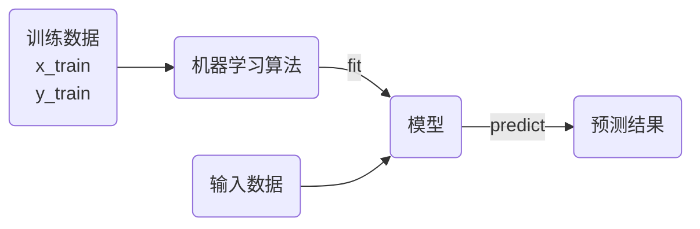
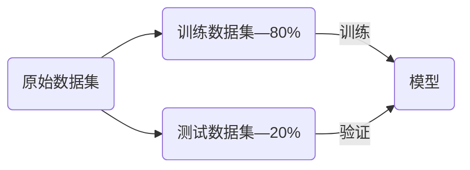
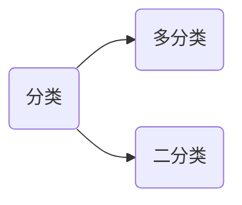
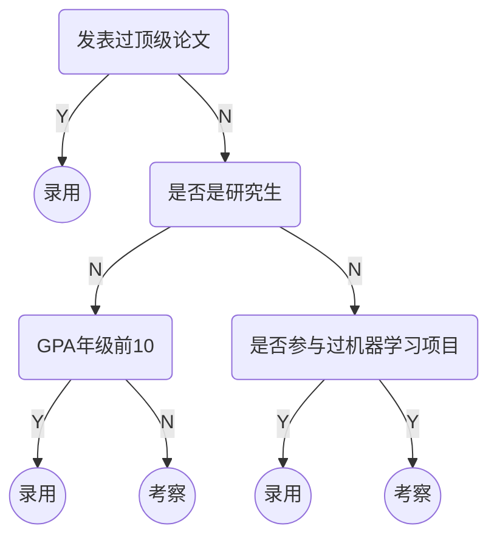
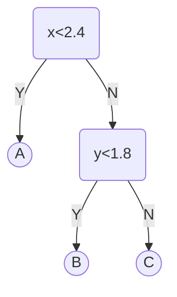
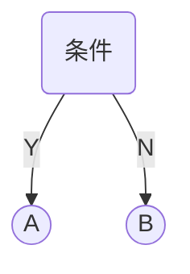
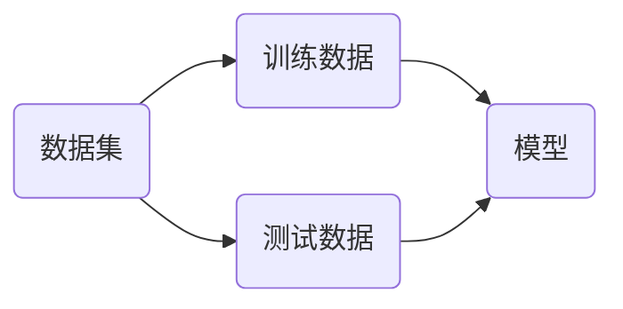
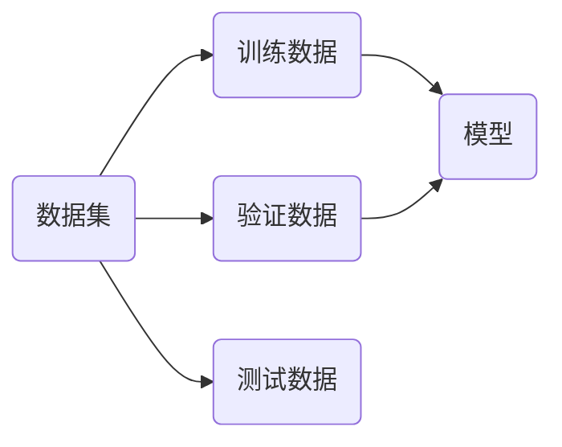
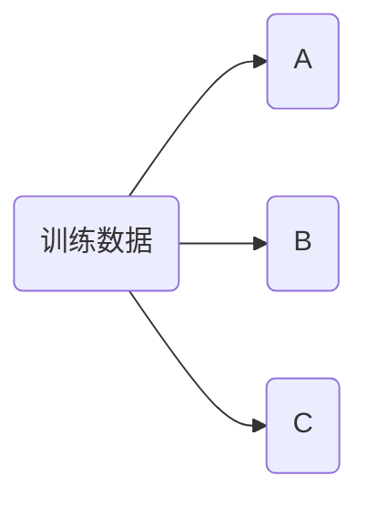

K近邻算法K-Nearest Neighbors（KNN）

1. 存在一定量的数据，包括特征和类别

2. 计算未知类别的数据与所有已知数据的距离。

3. 选择K个距离最小的样本，以最近的K个样本进行投票。

4. 未知样本与票数最多的样本一致。


KNN的基本思想是样本距离只够接近，样本的类型可以划分为一类。

```python
raw_data_x = [[1.4, 0.2],

[1.7, 0.4],

[1.5, 0.1],

[1.9, 0.2],

[1.6, 0.4],

[4.7, 1.4],

[4.9, 1.5],

[4.0, 1.3],

[4.4, 1.4],

[3.9, 1.1]]

raw_data_y = [0, 0, 0, 0, 0, 1, 1, 1, 1, 1]

x = [4.2, 1.5]
```

绘制上述样本数据的二维图像

```python
import numpy as np

import matplotlib.pyplot as plt


x_train = np.array(raw_data_x)

y_train = np.array(raw_data_y)

t = np.array(x)


plt.figure(figsize=(10, 8))

plt.scatter(x_train[y_train == 0, 0], x_train[y_train == 0, 1],

color='g', s=120, label='A')

plt.scatter(x_train[y_train == 1, 0], x_train[y_train == 1, 1],

color='r', s=120, label='B')

plt.scatter(t[0], t[1], color='b', s=120, label='Test Point')

plt.legend()

plt.show()
```

使用欧拉距离来表示两个样本点之间的差异，对于 $n$ 维向量 $x$​ 其距离公式为，欧拉距离为：

$$
\sqrt{\sum_{i=1}^n\left(x_i^{(a)}-x_i^{(b)} \right)^2}

$$

1. 计算样本间所有距离

```python
from math import sqrt


distances = []

for x_i in x_train:

d = sqrt(np.sum((x_i - t) ** 2))

distances.append(d)

# 使用列表生成式来计算全部距离

distances = [sqrt(np.sum((x_i - t) ** 2)) for x_i in x_train]
```

2. 对全部距离进行排序

```python
nearest = np.argsort(distances)
```

3. 选择最近的K个样本，并获取相应的监督数据

```python
k = 7

top_k_y = [y_train[i] for i in nearest[:k]]
```

4. 统计监督数据结果

```python
from collections import Counter


votes = Counter(top_k_y)

most = votes.most_common(1)

predict = most[0][0]
```

[`Counter`类是一个，用于数据统计](https://docs.python.org/zh-cn/3.9/library/collections.html?highlight=collections#counter-objects)

将上述算法过程封装成为一个函数

```python
def knn_classify(k, x_train, y_train, x):

assert 1 <= k <= x_train.shape[0], 'k must be valid'

assert x_train.shape[0] == y_train.shape[0], 'the size of x_train must be equal to the size of y_train'

assert x_train.shape[1] == x.shape[0], 'the feature number of x must be equal to x_train'


distances = [sqrt(np.sum((x_i - x) ** 2)) for x_i in x_train]

nearest = np.argsort(distances)


top_k_y = [y_train[i] for i in nearest[:k]]

votes = Counter(top_k_y)


return votes.most_common(1)[0][0]


predict = knn_classify(7, x_train, y_train, t)

print(predict)
```

* KNN算法是一个不需要训练过程的算法，可以认为KNN算法的模型就是全部训练数据本身。

* KNN算法的复杂度都集中在算法的预测过程，要从所有的样本数据中选出最小的K个距离。

## scikit-learn

[scikit-learn](https://scikit-learn.org/stable/#)是一个用于机器学习的 Python 库，提供了简单高效的工具来进行数据挖掘和数据分析，它建立在NumPy、SciPy和matplotlib基础之上。

安装scikit-learn包

```shell
pip install scikit-learn
```

可以使用scikit-learn工具包中[`KNeighborsClassifier`](https://scikit-learn.org/stable/modules/generated/sklearn.neighbors.KNeighborsClassifier.html#sklearn.neighbors.KNeighborsClassifier)实现KNN算法

```python
from sklearn.neighbors import KNeighborsClassifier


kNN_classifier = KNeighborsClassifier(n_neighbors=7)

kNN_classifier.fit(x_train, y_train)


x_predict = t.reshape(1, -1)

y_predict = kNN_classifier.predict(x_predict)

print(y_predict)
```

机器学习算法的流程



1. `fit`函数是训练模型，需要传入训练数据。

2. `predict`是预测函数，可以同时预测多个结果，传入数据必须为矩阵。`t.reshape`就是将预测数据转换为矩阵形式。

3. 预测结果也为二维矩阵。

### 模仿sklearn的KNN工具

根据sklearn的处理流程，完成一个类似的工具类。

```python
class KNNClassifier:

def __init__(self, k):

assert k >= 1, 'k must be valid'

self.k = k

self._x_train = None

self._y_train = None

def fit(self, x_train, y_train):

assert k <= x_train.shape[0], 'k must be valid'

assert x_train.shape[0] == y_train.shape[0], 'the size of x_train must be equal to the size of y_train'

self._x_train = x_train

self._y_train = y_train

return self

def predict(self, x_predict):

assert self._x_train is not None and self._y_train is not None, 'must fit before predict'

assert x_predict.shape[1] == self._x_train.shape[1], 'the feature number of x_predict must be equal to x_train'

y_predict = [self._predict(x) for x in x_predict]

return np.array(y_predict)

def _predict(self, x):

assert x.shape[0] == self._x_train.shape[1], 'the feature number of x must be equal to x_train'

distances = [sqrt(np.sum((x_train - x) ** 2)) for x_train in self._x_train]

nearest = np.argsort(distances)

top_k_y = [self._y_train[i] for i in nearest[:self.k]]

votes = Counter(top_k_y)

return votes.most_common(1)[0][0]

def __str__(self):

return 'KNN(k=%d)' % self.k
```

对数据进行预测

```python
knn_clf = KNNClassifier(k=7)

knn_clf.fit(x_train, y_train)

x_predict = t.reshape(1, -1)

y_predict = knn_clf.predict(x_predict)

print(y_predict)
```

## 数据集的划分

> [!note]

> 

> 对于对于已知数据集，如何测试机器学习算法性能的优劣？



使用测试数据解可以客观的评价算法和模型的性能。

#### sklearn中的数据集

[`sklearn.datasets`](https://scikit-learn.org/stable/datasets.html) 中嵌入了一些小型数据集用于实验。

* `loaders`用来加载小型测试数据集。

* `fetchers`用来下载并加载大的真实数据集

* 参数`data_home`可以控制下载的位置。

* `subset`可以控制下载训练集或测试集。

* [`fetch_openml`](https://scikit-learn.org/stable/modules/generated/sklearn.datasets.fetch_openml.html)从[OpenML](https://www.openml.org/)平台下载真实数据集。

两类函数都返回，类似字典的对象。加载完成的鸢尾花数据，`keys()`包含了数据集的所有属性。使用前面介绍的鸢尾花数据。

```python
from sklearn import datasets


iris = datasets.load_iris()

print(iris.keys())
```

`DESCR`打印数据集说明

```python
print(iris.DESCR)
```

`data`保存了数据的特征，`target`保存了监督数据的值。

```python
print(iris.data[:5, :])

print(iris.target[:5])
```

### 划分数据集

已知数据集中，数据排列可能是有序的。

```python
x = iris.data

y = iris.target

print(x.shape)

print(y.shape)

print(y)
```

在`sklearn.model_selection`模块中，包含一个数据集划分工具[`train_test_split`](https://scikit-learn.org/stable/modules/generated/sklearn.model_selection.train_test_split.html#train-test-split)。

```python
from sklearn.model_selection import train_test_split

x_train, x_test, y_train, y_test = train_test_split(x, y, test_size=0.2, random_state=666)


print(x_train.shape)

print(y_train.shape)

print(x_test.shape)

print(y_test.shape)
```

`test_size`测试数据集的大小默认值为0.2，`random_state`随机种子数。

使用鸢尾花数据集测试KNN算法.

```python
knn_clf = KNeighborsClassifier(n_neighbors=3)

knn_clf.fit(x_train, y_train)

y_predict = knn_clf.predict(x_test)

print(y_predict)

print(f'score: {sum(y_predict == y_test) / len(y_test)}')
```

[`accuracy_score`](https://scikit-learn.org/stable/modules/generated/sklearn.metrics.accuracy_score.html#sklearn.metrics.accuracy_score)函数可以根据测试集标的监督数据和预测结果，计算准确率。

```python
from sklearn.metrics import accuracy_score

print(accuracy_score(y_test, y_predict))
```

`KNeighborsClassifier`也有`score`函数可以直接计算准确率。

```python
knn_clf.score(x_test, y_test)
```

## 超参数

* **超参数**是指运行指定机器学习算法之前需要指定的参数。KNN算法中的K是典型的超参数。

* **模型参数**是指机器学习算法中学习的参数。KNN算法中没有模型参数。

### 近邻数K

寻找好的超参数：

1. 结合各领域知识、经验数值。

2. **实验搜索。**

```python
best_score = 0.0

best_k = -1

for k in range(1, 11):

knn_clf = KNeighborsClassifier(n_neighbors=k)

knn_clf.fit(x_train, y_train)

score = knn_clf.score(x_test, y_test)

if score > best_score:

best_k = k

best_score = score

print('best_k =', best_k)

print('best_score =', best_score)
```

* K值过小：容易受到异常点的影响。

* K值过大：受到样本均衡问题的影响。

### 距离权重

对于一般KNN算法，预测的点属于蓝色类。但是一般KNN算法忽略了，样本点之间的距离的影响。


考虑到距离对预测样本的影响，增加了距离权重的参数，权重等于距离的倒数（距离越近对位置样本的影响越大，距离越远对未知样本的影响越小）。

$$
\text{Red}=1\\

\text{Blue}=\frac{1}{3}+\frac{1}{4}=\frac{7}{12}

$$

计算距离权重之后，样本预测点属于红色。


使用距离权重后，可以有效的解决多分类数据中平票的情况。

在`KNeighborsClassifier`中通过参数`weights`可以选择是否计算权重。

```python
best_method = ''

best_score = 0.0

best_k = -1

for method in ['uniform', 'distance']:

for k in range(1, 11):

knn_clf = KNeighborsClassifier(n_neighbors=k, weights=method)

knn_clf.fit(x_train, y_train)

score = knn_clf.score(x_test, y_test)

if score > best_score:

best_k = k

best_score = score

best_method = method


print('best_k =', best_k)

print('best_score =', best_score)

print('best_method =', best_method)
```

### 距离类型

距离度量（distance measure），需满足如下基本性质：

1. 非负性：$\text{Dist}(X_i,X_j) \ge 0$；

2. 同一性：$\text{Dist}(X_i,X_j) = 0$。当且仅当$X_i=X_j$。

3. 对称性：$\text{Dist}(X_i,X_j) = \text{Dist}(X_j,X_i)$。

4. 三角不等式：$\text{Dist}(X_i,X_j) \le \text{Dist}(X_j,X_k) + \text{Dist}(X_k,X_j)$

评价两个向量的相似程度有多种标准，前面只用了简单的欧式距离。


1. 曼哈顿距离

$$
d=\sum_{i=1}^N|x_i-y_i|

$$

2. 欧拉距离

$$
d=\sqrt{\sum_{i=1}^n\left(x_i^{(a)}-x_i^{(b)} \right)^2}

$$

3. 明可夫斯基距离

$$
d=\left(\sum_{i=1}^N|x_i-y_i|^p\right)^{\frac{1}{p}}

$$

这里就获得了，距离计算的超参数 $p$，用来选择不同距离的标准。

```python
best_p = -1

best_k = -1

best_score = 0.0


for k in range(1, 11):

for p in range(1, 6):

knn_clf = KNeighborsClassifier(n_neighbors=k, weights='distance', p=p)

knn_clf.fit(x_train, y_train)

score = knn_clf.score(x_test, y_test)

if score > best_score:

best_k = k

best_score = score

best_p = p

print('best_k =', best_k)

print('best_p =', best_p)

print('best_score =', best_score)
```

对超参数p和K进行了搜索，只有计算距离权重的情况下才会引入超参数 p。

其他距离（在sklearn中使用其它距离有特殊的api）

* 切比雪夫距离 Chebyshev Distance

* 向量空间余弦相似度 Cosine Similarity

* 调整余弦相似度 Adjust Cosine Similarity

* 皮尔逊相关系数 Pearson Correlation Coefficient

* Jaccard相似系数 Jaccard Coefficient

### 网格搜索

使用sklearn的网格搜索工具[`GridSearchCV`](https://scikit-learn.org/stable/modules/generated/sklearn.model_selection.GridSearchCV.html)，可以更便捷的进行参数搜索。

```python
%%time

x_train, x_test, y_train, y_test = train_test_split(x, y, test_size=0.2, random_state=100)

param_grid = [

{

'weights': ['distance'],

'n_neighbors': [i for i in range(1, 11)],

'p': [i for i in range(1, 6)]

},

{

'weights': ['uniform'],

'n_neighbors': [i for i in range(1, 11)]

},

]


knn_clf = KNeighborsClassifier()


from sklearn.model_selection import GridSearchCV

grid_search = GridSearchCV(knn_clf, param_grid)


grid_search.fit(x_train, y_train)

print(grid_search.best_estimator_)

print(grid_search.best_score_)

print(grid_search.best_params_)
```

1. `param_grid`中的参数名称应该与函数名称一致，值是一个列表。

2. `grid_search.best_estimator_`最佳分类器，返回一个输入的分类器。

3. `grid_search.best_score_`最佳分类器的准确率。

4. `grid_search.best_params_`最佳分类器的相关参数。

`GridSearchCV`的参数搜索是采用**交叉验证**的方式进行的，参数预测结果和简单的变量会有出入。使用最佳模型对测试集进行预测

```python
knn_clf = grid_search.best_estimator_

knn_clf.score(x_test, y_test)
```

`GridSearchCV`中两个常用的参数

1. `n_jobs`设置参数搜索是使用的CPU核心数量，值为-1时使用全部处理器。

2. `verbose`打印搜索过程中的信息，值越大信息越详细。

```python
%%time

grid_search = GridSearchCV(knn_clf, param_grid, n_jobs=-1, verbose=2)

grid_search.fit(x_train, y_train)
```

## KD树

KNN每次需要预测一个点时，都需要计算训练数据集里每个点到这个点的距离，然后选出距离最近的K个点进行投票。当数据集很大时，这个计算成本非常高。

为了避免每次都重新计算一遍距离，算法会把距离信息保存在一棵树里，这样在计算之前从树里查询距离信息，尽量避免重新计算。构造的这个树叫KD树。

[KD树详解](https://search.bilibili.com/all?vt=11410619&keyword=kd%E6%A0%91&from_source=webtop_search&spm_id_from=333.1007&search_source=5)

## KNN算法特点

K近邻算法的优点：

* 可以解决分类问题（包括多分类问题）

* 使用k近邻算法可以解决回归问题，取K个近邻的平均值，或加权平均值。

* [`KNeighborsRegressor`](https://scikit-learn.org/stable/modules/generated/sklearn.neighbors.KNeighborsRegressor.html)K近邻解决回归问题的工具类。

K近邻算法的缺点：

* K近邻算法的计算效率低。如果训练集有 $m$ 个样本，$n$ 维特征，每预测一个新样本需要 $O(m\times n )$​ 的时间复杂度。

* K紧邻算法对异常点过于敏感。

* K近邻算法预测结果不具有可解释性。

* k近邻算法容易陷入位数灾难。维数灾难的一个特点是，随着维度的增加，数据点之间的距离也会变得越来越大。

| 维度 | 点 | 距离值 |

| ------- | -------------------------- | ------ |

| 1维 | 0到1 | 1 |

| 2维 | (0, 0)到(1, 1) | 1.414 |

| 3维 | (0, 0, 0)到(1, 1, 1) | 1.73 |

| 64维 | (0, 0, …, 0)到(1, 1, …, 1) | 8 |

| 10000维 | (0, 0, …, 0)到(1, 1, …, 1) | 100 |

逻辑回归：解决分类问题。



对于二分类问题，假设其中一个类别的概率为 $P_1$，不属于该类的概率是 $P_2$，则有：

$$
P_1+P_2=1

$$

二分类要求两个了类别是互斥的。将样本的特征和样本发生的概率联系起来，概率是一个数值，所以称为逻辑回归。

$$
\hat{p}=f(x) \qquad

\hat{y}=\begin{cases}

1, & \hat{p}\ge 0.5\\

0, & \hat{p}< 0.5\\

\end{cases}

$$

其中1和0表示不同的情况。

> [!warning]

> 

> 标准的逻辑回归用于分类，只能解决二分类问题。

在线性回归中

$$
\hat{y}=f(x) \Rightarrow \hat{y}=\theta^{T}\cdot x_b

$$

其中$\hat{y}\in \left [ -\infty, + \infty \right ]$ ，为了使结果映射到概率的值域$ \left [0, 1\right ]$，存在函数

$$
\hat{p}=\sigma \left( \theta^{T}\cdot x_b \right)

$$

其中

$$
\sigma(t)=\frac{1}{1+e^{-t}}

$$

称为sigmod函数。绘制该函数曲线

```python
import numpy as np

import matplotlib.pyplot as plt


def sigmoid(x):

return 1 / (1 + np.exp(-x))


x = np.linspace(-10, 10, 500)

y = sigmoid(x)


plt.figure(figsize=(10, 8))

plt.plot(x, y)

plt.scatter(0, sigmoid(0), color='red', s=120)

plt.text(0, sigmoid(0), '(0, 0.5)', fontsize=16, ha='right')

plt.grid(True, linestyle='--', alpha=0.5)

plt.xticks(fontsize=16)

plt.yticks(fontsize=16)

plt.show()
```

sigmod函数曲线的特点

* 值域是在$ \left [0, 1\right ]$之间。

* 当$t>0$时，$p>0.5$；当$t<0$时，$p<0.5$；当$t=0$时，$p=0.5$。

所以概率$\hat{p}$可以表示为

$$
\hat{p}=\sigma \left( \theta^{T}\cdot x_b \right)=\frac{1}{1+e^{-(\theta^{T}\cdot x_b)}} \qquad

\hat{y}=\begin{cases}

1, & \hat{p}\ge 0.5\\

0, & \hat{p}< 0.5\\

\end{cases}

$$

> [!warning]

> 

> 线性回归和逻辑回归的区别：

> 

> 1. 线性回归用于预测连续的值。

> 2. 逻辑回归用于分类。

逻辑回归的预测过程


> [!note]

> 

> 那么如何去衡量，逻辑回归的预测结果与真实结果的差异呢？

## 逻辑回归的损失函数

逻辑回归损失函数的特点

* 如果$y=1$，$p$越小，损失函数越大。

* 如果$y=0$，$p$越大，损失函数越大。

根据上述特点定义损失函数

$$
\text{cost} = \begin{cases}

-\log(\hat{p}) & \text{ if } y=1 \\

-\log(1-\hat{p}) & \text{ if } y=0

\end{cases}

$$

当$y=1$时，损失函数为$-\log(\hat{p})$


* $p$越小，损失函数越大。

* $p$越大，损失函数越小。

* 当$p=1$时，损失函数为0。

当$y=0$时，损失函数为$-\log(1-\hat{p})$，其中$-\log(1-x)$的曲线如下


所以$-\log(1-\hat{p})$的曲线为


* $p$越大，损失函数越大。

* $p$越小，损失函数越小。

* 当$p=0$时，损失函数为0。

将上面的分段函数整合为一个函数

$$
\text{cost}=-y\log(\hat{p})-(1-y)\log(1-\hat{p})

$$

所以m个样本的逻辑回归的损失函数为

$$
J(\theta)=-\frac{1}{m}\sum_i^{m}\left (y^{(i)}\log(\hat{p}^{(i)})+(1-y^{(i)})\log(1-\hat{p}^{(i)})\right)

$$

其中

$$
\hat{p}^{(i)}=\sigma \left( X_b^{(i)} \theta \right)=\frac{1}{1+e^{-(X_b^{(i)} \theta)}}

$$

二分类问题中，使用的损失函数称为**对数损失函数**。损失函数的计算如下


> [!warning]

> 

> 逻辑回归的优化目标也是使得损失函数值最小。

> 

> * 求损失函数的最小值，没有解析解。

> * 上述函数是凸函数，存在唯一的一个全局最优解。

> * 可以使用梯度下降法求解。

### 损失函数的梯度

根据上面的公式逻辑回归的损失函数表示为如下式子：

$$
J(\theta)=-\frac{1}{m}\sum_i^{m}\left (y^{(i)}\log \left(\sigma \left( X_b^{(i)} \theta \right)\right)+(1-y^{(i)})\log \left(1-\sigma \left( X_b^{(i)} \theta \right)\right)\right)

$$

其中对sigmod函数的导数，该倒数可以用其自身表示

$$
\sigma(t)=\frac{1}{1+e^{-t}} \Rightarrow

{\sigma(t)}' =\sigma(t)\cdot(1-\sigma(t))

$$

所以$\log\sigma(t)$的导数可以表示为

$$
{\log}'\sigma(t) \Rightarrow 1-\sigma(t)

$$

$\log(1-\sigma(t))$的导数可以表示为

$$
{\log}'(1-\sigma(t)) \Rightarrow -\sigma(t)

$$

整理可得

$$
\frac{\partial J(\theta )}{\partial \theta_j }= \frac{1}{m}\sum_{i=1}^{m}\left(\sigma(X_b^{(i)}\theta)-y^{(i)}\right)X^{(i)}_j=\frac{1}{m}\sum_{i=1}^{m}\left(\hat{y}^{(i)}-y^{(i)}\right)X^{(i)}_j

$$

所以逻辑回归的梯度可以表示为

$$
\nabla J(\theta )=

\begin{pmatrix}

\frac{\partial J}{\partial \theta_0 } \\

\frac{\partial J}{\partial \theta_1 } \\

\frac{\partial J}{\partial \theta_2 } \\

…\\

\frac{\partial J}{\partial \theta_n }

\end{pmatrix}

=\frac{1}{m}

\begin{pmatrix}

\sum_{i=1}^{m}(\hat{y}^{(i)}-y^{(i)}) \\

\sum_{i=1}^{m}(\hat{y}^{(i)}-y^{(i)})\cdot X_1^{(i)} \\

\sum_{i=1}^{m}(\hat{y}^{(i)}-y^{(i)})\cdot X_2^{(i)} \\

…\\

\sum_{i=1}^{m}(\hat{y}^{(i)}-y^{(i)})\cdot X_n^{(i)} \\

\end{pmatrix}

=\frac{1}{m} \cdot X_b^T \cdot (\sigma(X_b\theta)-y)

$$

## sklearn的逻辑回归

sklearn中逻辑回归使用了正则化的处理方式

$$
C\cdot J(\theta)+L_1 \\

C\cdot J(\theta)+L_2

$$

其中正则化系数$C$在损失函数前面，$C$损失函数越重要。

使用sklearn中的癌症数据集[`load_breast_cancer`](https://scikit-learn.org/stable/modules/generated/sklearn.datasets.load_breast_cancer.html#sklearn.datasets.load_breast_cancer)测试逻辑回归模型

```python
from sklearn import datasets


cancer = datasets.load_breast_cancer()

print(cancer.DESCR)
```

划分测试集和验证集

```python
from sklearn.model_selection import train_test_split


x = cancer.data

y = cancer.target

x_train, x_test, y_train, y_test = train_test_split(x, y, random_state=42)

print(x_train.shape)

print(x_test.shape)
```

使用sklearn的逻辑回归[`LogisticRegression`](https://scikit-learn.org/stable/modules/generated/sklearn.linear_model.LogisticRegression.html)来训练模型和预测

```python
from sklearn.linear_model import LogisticRegression


log_reg = LogisticRegression()

log_reg.fit(X_train, y_train)

print(log_reg.score(X_train, y_train))

print(log_reg.score(X_test, y_test))
```

默认的逻辑回归函数采用$L_2$正则，$C=1$。`load_breast_cancer`数据默认没有归一化，对数据进行归一化

```python
from sklearn.pipeline import Pipeline

from sklearn.preprocessing import StandardScaler


pipeline = Pipeline([

('scaler', StandardScaler()),

('log_reg', LogisticRegression())

])

pipeline.fit(x_train, y_train)

print(pipeline.score(x_train, y_train))

print(pipeline.score(x_test, y_test))
```

## 逻辑回归的多项式特征

升维可以使线性不可分的数据变为线性可分


生成模拟数据

```python
import numpy as np

import matplotlib.pyplot as plt


np.random.seed(666)


X = np.random.normal(0, 1, size=(200, 2))

y = np.array(X[:, 0]**2 + X[:, 1]**2 < 1.5, dtype=int)


plt.scatter(X[y==0, 0], X[y==0, 1], color='red')

plt.scatter(X[y==1, 0], X[y==1, 1], color='blue')

plt.show()
```

使用模拟数据来训练模型

```python
from sklearn.preprocessing import PolynomialFeatures


def PolynomialLogisticRegression(degree, C=1):

return Pipeline([

('poly', PolynomialFeatures(degree=degree)),

('std_scaler', StandardScaler()),

('log_reg', LogisticRegression(C=C))

])


poly_log_reg = PolynomialLogisticRegression(degree=2)

poly_log_reg.fit(x_train, y_train)

print(poly_log_reg.score(x_train, y_train))

print(poly_log_reg.score(x_test, y_test))
```

在实际应用中数据分布不可能是规则的圆形，多项式特征的`degree`可以取更大的值。

> [!warning]

> 

> 逻辑回归本质上是找到一条直线，用直线来分割样本的类别。通过对数据添加多项式向，可以使得逻辑回归对非线性的数据同时起作用。

## 逻辑回归的多分类问题

### OvR（One vs Rest）


如果有$n$个类别进行$n$次分类，选择分类得分最高的。需要训练$n$个模型。

### OvO（One vs One）


需要训练$C_n^2$个模型，样本在每个模型上进行分类，选择分类数量最多的类别。

### sklearn中的多分类

使用鸢尾花数据训练多分类模型

```python
iris = datasets.load_iris()

X = iris.data[:, :2]

y = iris.target


X_train, X_test, y_train, y_test = train_test_split(X, y, random_state=666)


log_reg = LogisticRegression()

log_reg.fit(X_train, y_train)

print(log_reg.score(X_test, y_test))
```

sklearn中逻辑回归多分类默认采用`atuo`模式，回自动适配分类模型。

> [!warning]

> 

> 在`sklearn.multiclass`中，包含`OneVsRestClassifier`和`OneVsOneClassifier`可以用于二分类器的封装，完成多分类任务。

## 模型的保存和加载

使用`joblib`包，可以保存训练的模型。默认安装sklearn是自动安装该包，如果没有可以使用命令`pip install joblib`单独安装。

### 保存训练模型

```python
import joblib


x = cancer.data

y = cancer.target

x_train, x_test, y_train, y_test = train_test_split(x, y, random_state=42)


pipeline = Pipeline([

('scaler', StandardScaler()),

('log_reg', LogisticRegression())

])

pipeline.fit(x_train, y_train)

joblib.dump(pipeline, 'cancer.pkl')
```

### 加载已保存模型

```python
model = joblib.load('cancer.pkl')

print(model.score(x_test, y_test))

result = model.predict(x_test)

print(result.shape)
```

> [!note]

> 

> 一个癌症预测系统，输入体检信息，可以判断是否有癌症，该系统的预测准确率（Accuracy）是$99.9\%$。

如果该癌症的发病率是$0.1\%$。只要系统预测所以人都是健康的，系统的准确率即可达到$99.9\%$；如果该癌症的发病率是$0.01\%$。只要系统预测所以人都是健康的，系统的准确率即可达到$99.99\%$

> [!warning]

> 

> 上述情况的数据称为极度偏斜（Skewed Data）。所以分类准确率远远不能表示分类器性能。

## 混淆矩阵

混淆矩阵（Confusion Matrix），对于二分类问题，混淆矩阵如下。

| | 预测为$\hat P$ | 预测为$\hat N$ |

| -------------------------- | -------------------- | -------------------- |

| 真实$P$（正样本 Positive） | TP（True Positive） | FN（False Negative） |

| 真实$N$（负样本 Negative） | FP（False Positive） | TN（True Negative） |

假设有10000人，其癌症预测结果的混淆矩阵如下

| | $\hat P$ | $\hat N$ |

| ---- | -------- | -------- |

| $P$ | 8 | 2 |

| $N$ | 12 | 9978 |

## 精确率和召回率

| | $\hat P$ | $\hat N$ | |

| ---- | ------------------------------------------------------------ | -------- | ------------------------------------------------------------ |

| $P$ | TP | FN | 召回率$\text{Recall} = \frac{\text{TP}}{\text{TP} + \text{FN}}$ |

| $N$ | FP | TN | |

| | 精确率$\text{Precision} = \frac{\text{TP}}{\text{TP} + \text{FP}}$ | | 准确率$\text{Accuracy}=\frac{\text{TP+TN}}{\text{ALL}}$ |

1. 通常在有偏数据中将分类为正样本作为关注的对象。

2. 精确率表示预测关注的事件有多准。

3. 召回率表示关注的事件，真实发生后，被成功预测的有多少。

在癌症预测中计算精确率和召回率

| | $\hat P$ | $\hat N$ | |

| ---- | ------------------------------------------ | -------- | ---------------------------------------------- |

| $P$ | 8 | 2 | $\text{Recall} = \frac{8}{8 + 2}=80\%$ |

| $N$ | 12 | 9978 | |

| | $\text{Precision} = \frac{8}{12 + 8}=40\%$ | | $\text{Accuracy}=\frac{8+9978}{10000}=99.86\%$ |

1. 上述预测的精确率表示预测癌症的成功率。

2. 召回率表示癌症患者被成功找到的概率。


对于10000个人，癌症的发病率为$0.1\%$，预测所以人为健康的

| | $\hat P$ | $\hat N$ | |

| ---- | ------------------------------------ | -------- | ------------------------------------------- |

| $P$ | 0 | 10 | $\text{Recall} = \frac{0}{10 + 0}=0$ |

| $N$ | 0 | 9990 | |

| | $\text{Precision} = \frac{0}{0 + 0}$ | | $\text{Accuracy}=\frac{9990}{10000}=99.9\%$ |

1. 精确率的计算无意义。

2. 召回率为0。

### sklearn计算精确率和召回率

导入癌症数据集，划分训练集和测试集

```python
from sklearn import datasets

from sklearn.model_selection import train_test_split


cancer = datasets.load_breast_cancer()

print(cancer.target_names)

x = cancer.data

y = cancer.target

x_train, x_test, y_train, y_test = train_test_split(x, y, random_state=42)
```

训练模型并预测

```python
from sklearn.preprocessing import StandardScaler

from sklearn.pipeline import Pipeline

from sklearn.linear_model import LogisticRegression


pipeline = Pipeline([

('scaler', StandardScaler()),

('log_reg', LogisticRegression())

])

pipeline.fit(x_train, y_train)

y_hat = pipeline.predict(x_test)
```

计算混淆矩阵、精确率和召回率，函数均在[`metrics`](https://scikit-learn.org/stable/api/sklearn.metrics.html)包中。

```python
from sklearn.metrics import confusion_matrix, precision_score, recall_score


print(confusion_matrix(y_test, y_log_predict))

print(precision_score(y_test, y_log_predict))

print(recall_score(y_test, y_log_predict))
```

[`classification_report`](https://scikit-learn.org/stable/modules/generated/sklearn.metrics.classification_report.html)可以打印评估报告

```python
from sklearn.metrics import classification_report


print(classification_report(

y_test, y_hat, target_names=cancer.target_names

))
```

### 精确率和召回率的选择

在现实应用中不同的算法精确率和召回率，表现不尽相同：

* 算法一，精确率高，召回率低。

* 算法二，精确率低，召回率高。

> [!note]

> 

> 如何选择合适的算法？

算法的选择需要依据实际问题确定。

* 股票涨跌的分类问题。

* 癌症病人的分类问题。

如果需要同时兼顾精确率和召回率，使用评价标准F1-Score。

$$
F_1=\frac{2\cdot\text{Precision}\cdot\text{Recall}}{\text{Precision}+\text{Recall}}

$$

F1-Score本质描述的是精确率和召回率的**调和平均值**。F1-Score的特性是如果精确率和召回率不平衡，F1-Score的计算值会非常低。F1-Score计算

```python
from sklearn.metrics import f1_score


print(f1_score(y_test, y_log_predict))
```

上述的计算结果明显低于准确率的计算结果。

### 精确率和召回率的关系

逻辑回归的数学表示如下

$$
\hat{p}=

\sigma \left( \theta^{T}\cdot x_b \right)=\frac{1}{1+e^{\theta^{T}\cdot x_b}} \qquad

\hat{y}=

\begin{cases}

1, & \hat{p}\ge 0.5 \Rightarrow \theta^{T}\cdot x_b \ge 0\\

0, & \hat{p}< 0.5 \Rightarrow \theta^{T}\cdot x_b < 0 \\

\end{cases}

$$

其中$\theta^{T}\cdot x_b=0$为二者的决策边界，假设决策边界的阈值可以修改

$$
\theta^{T}\cdot x_b=\text{threshold}

$$

上述改动相当于给算法引入一个新的超参数threshold，通过修改该参数，可以平移决策边界。从而影响分类结果。

1. 当$\text{threshold}=0$，时精确率和召回率的示意图


2. 当$\text{threshold}>0$，时精确率和召回率的示意图


3. 当$\text{threshold}<0$，时精确率和召回率的示意图


精确率和召回率的变化根据分类阈值变化而变化：

1. 阈值越高精确率越高，召回率越低。

2. 阈值越低精确率越低，召回率越高。

精确率和召回率变化示意图


使用程序验证精确率和召回率的变化

sklearn中使用[`decision_function`](https://scikit-learn.org/stable/glossary.html#term-decision_function)用来计算样本到决策边界的有符号距离

```python
import numpy as np


print(pipeline.decision_function(x_test)[:10])

decision_scores = pipeline.decision_function(x_test)

print(np.min(decision_scores))

print(np.max(decision_scores))
```

当$\text{threshold}>0$时预测的精确率和召回率

```python
y_hat_2 = np.array(decision_scores >= 5, dtype='int')

print(confusion_matrix(y_test, y_hat_2))

print(precision_score(y_test, y_hat_2))

print(recall_score(y_test, y_hat_2))
```

当$\text{threshold}<0$时预测的精确率和召回率

```python
y_predict_3 = np.array(decision_scores >= -5, dtype='int')

print(confusion_matrix(y_test, y_predict_3))

print(precision_score(y_test, y_predict_3))

print(recall_score(y_test, y_predict_3))
```

绘制PR曲线

```python
from sklearn.metrics import precision_recall_curve

import matplotlib.pyplot as plt


precisions, recalls, thresholds = precision_recall_curve(y_test, decision_scores)

plt.figure(figsize=(10, 8))

plt.plot(precisions, recalls, linewidth=2)

plt.xticks(fontsize=16)

plt.yticks(fontsize=16)

plt.show()
```

> [!warning]

> 

> 在sk-learn中`thresholds`比`precisions`和`recalls`多一个值。

使用PR曲线可以比较不同模型的性能


模型B要比模型A好，因为模型B无论是精准率还是召回率都要比模型A的高。

## ROC曲线

ROC曲线是Receiver Operation Characteristic Curve缩写，最早在统计学领域使用。ROC用来描述分类模型的TPR和FPR之间的关系，从而确定分类模型的好坏。

| | $\hat P$ | $\hat N$ | | 坐标轴 |

| ---- | -------- | -------- | ------------------------------------------------------ | ------ |

| $P$ | TP | FN | $\text{TPR} = \frac{\text{TP}}{\text{TP} + \text{FN}}$ | y轴 |

| $N$ | FP | TN | $\text{FPR} = \frac{\text{FP}}{\text{FP} + \text{TN}}$ | x轴 |

* TPR是预测正确的正样本，占**真实正样本**的比例。

* FPR是预测错误的正样本，占**真实负样本**的比例。

| | $P$共A个样本 | $N$共B个样本 |

| ------------------------------------- | ---------------------------------------------------- | ---------------------------------------------------- |

| $\hat P$ | a | b |

| | $\text{TPR} = \frac{\text{a}}{\text{A}}$ | $\text{FPR} = \frac{\text{b}}{\text{B}}$ |

| 概率阈值为0时，所以样本都预测为正样本 | $a=A \rightarrow \frac{a}{A}=1$<br>预测对的正样本为A | $b=B \rightarrow \frac{b}{B}=1$<br>预测错的正样本为B |

| 概率阈值为1时，所以样本都预测为负样本 | $a=0 \rightarrow \frac{a}{A}=0$<br>预测对的正样本为0 | $b=0 \rightarrow \frac{b}{B}=0$<br>预测错的正样本为0 |

计算下面10个样本的预计结果的ROC曲线

| 样本编号 | 1 | 2 | 3 | 4 | 5 | 6 | 7 | 8 | 9 | 10 |

| -------- | ---- | ---- | ---- | ---- | ---- | ---- | ---- | ---- | ---- | ---- |

| 真实标签 | 1 | 0 | 1 | 0 | 1 | 0 | 1 | 0 | 1 | 0 |

| 预测概率 | 0.9 | 0.8 | 0.75 | 0.7 | 0.6 | 0.55 | 0.4 | 0.3 | 0.2 | 0.1 |

阈值为1时：所有预测标签均为0，所以TPR和FPR均为0。ROC曲线的计算过程如下

| 阈值 | TP | FP | FN | TN | TPR | FPR |

| ---- | ---- | ---- | ---- | ---- | ---- | ---- |

| 1.0 | 0 | 0 | 5 | 5 | 0.0 | 0.0 |

| 0.9 | 1 | 0 | 4 | 5 | 0.2 | 0.0 |

| 0.8 | 1 | 1 | 4 | 4 | 0.2 | 0.2 |

| 0.75 | 2 | 1 | 3 | 4 | 0.4 | 0.2 |

| 0.7 | 2 | 2 | 3 | 3 | 0.4 | 0.4 |

| 0.6 | 3 | 2 | 2 | 3 | 0.6 | 0.4 |

| 0.55 | 3 | 3 | 2 | 2 | 0.6 | 0.6 |

| 0.4 | 4 | 3 | 1 | 2 | 0.8 | 0.6 |

| 0.3 | 4 | 4 | 1 | 1 | 0.8 | 0.8 |

| 0.2 | 5 | 4 | 0 | 1 | 1.0 | 0.8 |

| 0.1 | 5 | 5 | 0 | 0 | 1.0 | 1.0 |

sklearn中使用`roc_curve`计算ROC曲线的参数，绘制上述样本的ROC曲线

```python
from sklearn.metrics import roc_curve


# 真实标签

y_true = [1, 0, 1, 0, 1, 0, 1, 0, 1, 0]


# 预测概率

y_scores = [0.9, 0.8, 0.75, 0.7, 0.6, 0.55, 0.4, 0.3, 0.2, 0.1]


fpr, tpr, _ = roc_curve(y_true, y_scores)

plt.figure(figsize=(10, 10))

plt.plot(fpr, tpr, marker='o', label='ROC Curve', linewidth=2)

plt.xticks(fontsize=16)

plt.yticks(fontsize=16)

plt.legend(fontsize=16)

plt.grid(True)

plt.show()
```

绘制癌症分类的ROC曲线

```python
from sklearn.metrics import roc_curve


fprs, tprs, thresholds = roc_curve(y_test, decision_scores)

plt.figure(figsize=(10, 8))

plt.plot(fprs, tprs, linewidth=2)

plt.xticks(fontsize=16)

plt.yticks(fontsize=16)

plt.show()
```

通过ROC曲线分析模型性能


ROC曲线下面的面积称为AUC面积，面积越大分类性能越好。


AUC的最大值是1。[ROC-AUC原理及计算方法](https://rogerspy.github.io/2021/07/29/roc-auc/)

评价标准的比较

| 评价标准 | 问题 |

| -------------- | ---------------------------------------------------------- |

| 准确率 | 1. 容易被样本不均衡性<br />2. 指标被阈值影响 |

| 精确率和召回率 | 1. 每个指标只反映一类预测结果的指标<br />2. 指标被阈值影响 |

| ROC曲线和AUC值 | 用于比较两个模型的性能 |

## 多分类问题的混淆矩阵

sklearn的`precision_score`函数中有参数可以实现多分类的精确率计算

```python
iris = datasets.load_iris()

X = iris.data

y = iris.target


X_train, X_test, y_train, y_test = train_test_split(X, y, random_state=95)

log_reg = LogisticRegression()

log_reg.fit(X_train, y_train)

log_reg.score(X_test, y_test)

y_predict = log_reg.predict(X_test)

print(precision_score(y_test, y_predict, average='micro'))
```

混淆矩阵可以用于表示多分类的性能，打印多分类问题的混淆矩阵

```python
print(confusion_matrix(y_test, y_predict))
```

混淆矩阵的可视化

```python
cfm = confusion_matrix(y_test, y_predict)

plt.matshow(cfm, cmap=plt.cm.gray)

plt.xticks(fontsize=16)

plt.yticks(fontsize=16)

plt.show()
```

为了更清楚的看到预测错误的区域可以对混淆矩阵进行如下处理

```python
row_sums = np.sum(cfm, axis=1)

err_matrix = cfm / row_sums

np.fill_diagonal(err_matrix, 0)

print(err_matrix)

plt.matshow(err_matrix, cmap=plt.cm.gray)

plt.xticks(fontsize=16)

plt.yticks(fontsize=16)

plt.show()
```

## 分类不平衡的处理

[imbalanced-learn](https://imbalanced-learn.org/stable/)工具包用于处里数据不平衡问题。安装`pip install imbalanced-learn`

使用[`make_classification`](https://scikit-learn.org/stable/modules/generated/sklearn.datasets.make_classification.html)生成模拟数据

```python
from sklearn.datasets import make_classification


X, y = make_classification(n_samples=5000, n_features=2, n_classes=3,

n_informative=2, n_redundant=0,

n_repeated=0, n_clusters_per_class=1,

weights=[0.01, 0.05, 0.94], random_state=0)
```

使用[`Counter`](https://docs.python.org/zh-cn/3.11/library/collections.html#counter-objects)类统计样本个数

```python
from collections import Counter


Counter(y)
```

绘制数据分布

```python
def plot_distribution(X, y):

plt.figure(figsize=(10, 8))

plt.scatter(X[:, 0], X[:, 1], c=y, s=100, cmap='viridis')

plt.xticks(fontsize=16)

plt.yticks(fontsize=16)

plt.show()

plot_distribution(X, y)
```

### 过采样法

增加一些少数类样本使得正、反例数目接近。

1. 随机过采样方法：随机复制少数类的样本，将它扩大到与多少类样本数量接近。

```python
from imblearn.over_sampling import RandomOverSampler


ros = RandomOverSampler(random_state=0)

X_resampled, y_resampled = ros.fit_resample(X, y)

Counter(y_resampled)

plot_distribution(X_resampled, y_resampled)
```

容易造成模型的过拟合问题。

2. SMOTE算法（Synthetic Minority Oversampling）合成少数类过采样技术。


```python
from imblearn.over_sampling import SMOTE


X_resampled, y_resampled = SMOTE().fit_resample(X, y)

Counter(y_resampled)

plot_distribution(X_resampled, y_resampled)
```

### 欠采样方法

除一些多数类中的样本使得正例、反例数目接近。随机欠采样方法：随机选择一些多数量样本从训练数据中移除。

```python
from imblearn.under_sampling import RandomUnderSampler


rus = RandomUnderSampler(random_state=0)

X_resampled, y_resampled = rus.fit_resample(X, y)

Counter(y_resampled)

plot_distribution(X_resampled, y_resampled)
```

随机欠采样方法可能会造成重要信息丢失。

支持向量机（supported vector machine，简称：SVM）的算法的本质是找到一个在两类样本中间位置的分界线。

* 等价于两个类别距离分界线最近的点，到分界线的距离相等。

* 两个类别距离分界线最近的点，构成一个区域，理想条件下，这个区域内没有样本点。

* 两个类别距离分界线最近的点，被称为支撑向量。

* SVM特别适用于中小型复杂数据集的分类。


支撑向量机算法：

1. 找到这些支撑向量。

2. 最大化margin。


间隔的分类：

* 硬边界分类 ：所有样本均归类于虚线之外。

* 软边缘分类：目标是尽可能在保持最大间隔，和限制间隔违例之间找到平衡。


> [!warning]

> 

> 当两类数据间可以选择多条分类边界时，称为不适定问题。

## Margin的数学表达

在$n$维空间中直线方程可以表示为$w^Tx+b=0$，也可以表示为$\theta^Tx_b=0$。设正样本$1$表示，负样本用$-1$表示。上述式子可以化简为

$$
\left\{\begin{matrix}

w^Tx^{(i)}+b \ge 1 & \forall y^{(i)}=1 \\

w^Tx^{(i)}+b \le -1 & \forall y^{(i)}=-1

\end{matrix}\right.

$$

中间分界线的方程为

$$
w^Tx^{(i)}+b = 0

$$

重新定义直线的参数这有

$$
w^Tx+b = 1 \\

w^Tx+b = 0 \\

w^Tx+b = -1

$$

直线的示意图如下


支持向量机公式表示为

$$
\left\{\begin{matrix}

w^Tx^{(i)}+b \ge 1 & \forall y^{(i)}=1 \\

w^Tx^{(i)}+b \le -1 & \forall y^{(i)}=-1

\end{matrix}\right.

$$

所以上面的分类器可以统一为

$$
y^{(i)}(w^Tx^{(i)}+b) \ge 1

$$

支持向量机的算法目标是最大化间隔$d$。等价于

$$
\max \frac{2|w^Tx+b|}{||w||}

$$

由于所有的$x$都是支撑向量，所以$|w^Tx+b|=1$，所以上述公式可以表示为

$$
\max \frac{2}{||w||}

$$

最大化上面的值可以表示为，最小化公式

$$
\max \frac{2}{||w||} \Rightarrow \frac{1}{\min\frac{1}{2}||w||}

$$

所以SVM的优化目标为

$$
\begin{cases}

y^{(i)}(w^Tx^{(i)}+b) \ge 1\\

\min \frac{1}{2}||w||^2 \\

\end{cases}

$$

在这个优化目标函数之间没有任何样本点，称为Hard Margin SVM。

> [!warning]

> 

> 支持向量机的最优化是有条件的最优化问题，可以使用[拉格朗日乘子法]( https://www.bilibili.com/video/BV1NH4y1q7Ef/?share_source=copy_web&vd_source=aa661569ff3138d0b604d53a96184bf2)求解。

## Soft Margin SVM

一般的情况下，大部分数据是线性不可分的


SVM分类器无法使得所有的$i\in M$满足下列公式

$$
y^{(i)}(w^Tx^{(i)}+b) \ge 1

$$

为了能够正确分类，可以放松分类器的限制。在Hard Margin SVM目标函数中增加一个宽松量，表示如下

$$
y^{(i)}(w^Tx^{(i)}+b) \ge 1-\zeta_i, \quad \zeta_i>0

$$

上面的目标函数表示，允许一些数据点分布在绿线和黄线之间，如下图所示


其中，对于每个样本数据存在不同$\zeta_i$。如果当$\zeta$无穷大时，意味着容错性无穷大，故而分不出类别。为控制$\zeta$的范围，增加正则项

$$
\min \left(\frac{1}{2}||w||^2+C\sum_i^m\zeta_i\right)

$$

其中$C$是超参数，用于平衡超参数的比例。Soft Margin SVM的分类器目标函数表示如下：

$$
\begin{cases}

y^{(i)}(w^Tx^{(i)}+b) \ge 1-\zeta_i, \quad \zeta_i>0\\

\min \left(\frac{1}{2}||w||^2+C\sum_i^m\zeta_i\right) \\

\end{cases}

$$

上面的目标函数相当于增加了L1正则。L2正则的目标函数表示如下

$$
\begin{cases}

y^{(i)}(w^Tx^{(i)}+b) \ge 1-\zeta_i, \quad \zeta_i>0\\

\min \left(\frac{1}{2}||w||^2+C\sum_i^m\zeta_i^2\right) \\

\end{cases}

$$


* C值低，间隔较大，分类的错误样本较多；间隔小，更容易出现欠拟合现象。

* C值高，间隔较小，分类的错误样本较少；间隔小，更容易出现过拟合现象。

> [!warning]

> 

> 对于线性不可分的情况，支持向量是由边界点和错误点共同组成。

## sklearn中的svm

> [!attention]

> 

> 使用SVM前需要对数据进行标准化处理。

使用癌症数据集并使用PCA降维得到

```python
from sklearn import datasets

from sklearn.preprocessing import StandardScaler

from sklearn.decomposition import PCA


cancer = datasets.load_breast_cancer()

x = cancer.data

y = cancer.target

x_std = StandardScaler().fit_transform(x)

pca = PCA(n_components=2)

pca.fit(x_std)

x_reduction = pca.transform(x_std)
```

绘制数据图像

```python
import matplotlib.pyplot as plt


def plot_pca(x_std, y):

plt.figure(figsize=(10, 8))

plt.scatter(x_std[:, 0], x_std[:, 1], c=y, s=100)

plt.xticks(fontsize=16)

plt.yticks(fontsize=16)

plt.show()

plot_pca(x_reduction, y)
```

对数据进行标准化处理，并划分训练集与测试集

```python
from sklearn.preprocessing import StandardScaler


standardScaler = StandardScaler()

standardScaler.fit(x_reduction)

x_standard = standardScaler.transform(x_reduction)
```

导入SVM类，其中`C=1e9`取一个非常大的值，SVM分类器为Hard SVM，训练模型

```python
from sklearn.svm import LinearSVC


svc = LinearSVC(C=1e9)

svc.fit(x_standard, y)

print(svc.score(x_standard, y))
```

绘制分类边界

```python
import numpy as np

import matplotlib.pyplot as plt

from sklearn.inspection import DecisionBoundaryDisplay

from sklearn.svm import LinearSVC


def plot_svm_boundary(svc, X, y):

plt.figure(figsize=(10, 8))

DecisionBoundaryDisplay.from_estimator(

svc,

X,

plot_method="contour",

colors="k",

levels=[-1, 0, 1],

alpha=0.5,

linestyles=["--", "-", "--"],

ax=plt.gca()

)

plt.scatter(X[:, 0], X[:, 1], c=y, s=100, cmap=plt.cm.Paired)


if hasattr(svc, 'coef_'):

decision_function = svc.decision_function(X)

support_vector_indices = np.where(np.abs(decision_function) <= 1 + 1e-15)[0]

support_vectors = X[support_vector_indices]

plt.scatter(support_vectors[:, 0], support_vectors[:, 1],

s=100, facecolors='none', edgecolors='k', linewidths=1.5,

label='Support Vectors')

plt.legend()

plt.xticks(fontsize=16)

plt.yticks(fontsize=16)

plt.show()


plot_svm_boundary(svc, x_standard, y)
```

当`C=0.01`时，SVM分类器为Soft SVM，训练模型，绘制分类边界

```python
svc2 = LinearSVC(C=0.01)

svc2.fit(x_standard, y)

print(svc2.score(x_standard, y))

plot_decision_boundary(svc, x_standard, y
```

## 非线性数据分类

使用sklearn的`datasets.make_moons`函数生成测试数据

```python
x, y = datasets.make_moons()

print(x.shape)

print(y.shape)

plt.figure(figsize=(10, 8))

plt.scatter(x[y==0,0],x[y==0,1], color='red', s=100)

plt.scatter(x[y==1,0],x[y==1,1], color='blue', s=100)

plt.xticks(fontsize=16)

plt.yticks(fontsize=16)

plt.show()
```

给生成数据集添加扰动

```python
x, y = datasets.make_moons(noise=0.15, random_state=666)

plt.figure(figsize=(10, 8))

plt.scatter(x[y==0,0],x[y==0,1],color='red', s=100)

plt.scatter(x[y==1,0],x[y==1,1],color='blue', s=100)

plt.xticks(fontsize=16)

plt.yticks(fontsize=16)

plt.show()
```

对于非线性数据，可以使用多项式特征对非线性数据分类

```python
from sklearn.preprocessing import PolynomialFeatures

from sklearn.pipeline import Pipeline


def PolynomialSVC(degree, C=1.0):

return Pipeline([

('poly', PolynomialFeatures(degree=degree)),

('std_scaler', StandardScaler()),

('linearSVC', LinearSVC(C=C))

])


poly_svc = PolynomialSVC(degree=3)

poly_svc.fit(x,y)

print(poly_svc.score(x,y))
```

绘制分界面

```python
plot_svm_boundary(poly_svc, x, y)
```

### 核函数

核函数的作用就是一个从低维空间到高维空间的映射，而这个映射可以把低维空间中线性不可分的两类点变成线性可分的。


> [!warning]

> 

> 核函数这种转换方式，不止限于SVM分类器中。

$$
w^Tx+b = 0 \Rightarrow w^TK(x)+b = 0

$$

常用的核函数

| 核函数 | 公式 | 对应升维空间 |

| ------------------------------- | ------------------------------------------ | ------------ |

| 线性核<br />Linear Kernel | $K( x_i, x)=\langle x_i, x \rangle$ | 原始特征空间 |

| 多项式核<br />Polynomial Kernel | $K( x_i, x)=(a\langle x_i, x \rangle+b)^d$ | 多项式空间 |

| 高斯核<br />Gaussian Kernel | $K(x_i, x)=\exp{(-\gamma||x_i-x||^2)}$ | 无穷维空间 |

### 多项式核

SVM分类器中有多项式核函数可以直接对非线性数据进行分类，分类器为[`SVC`](https://scikit-learn.org/stable/modules/generated/sklearn.svm.SVC.html)，训练分类器

```python
from sklearn.svm import SVC


def PolynomialKernelSVC(degree, C=1.0):

return Pipeline([

('std_scaler', StandardScaler()),

('kernelSVC', SVC(kernel='poly', degree=degree, C=C))

])


poly_kernel_svc = PolynomialKernelSVC(degree=3)

poly_kernel_svc.fit(x,y)

print(poly_kernel_svc.score(x,y))

plot_svm_boundary(poly_kernel_svc, x, y)
```

$d$代表多项式中的degree，$c$代表Soft Margin SVM中的$C$，是两个超参数。使用`coef0`和`gamma`

```python
def PolynomialKernelSVC2(degree, C=1.0):

return Pipeline([

('std_scaler', StandardScaler()),

('kernelSVC', SVC(kernel='poly', degree=degree, C=C, coef0=1.0, gamma=1.0))

])


poly_kernel_svc = PolynomialKernelSVC2(degree=3)

poly_kernel_svc.fit(x,y)

print(poly_kernel_svc.score(x,y))

plot_svm_boundary(poly_kernel_svc, x, y)
```

### 高斯核函数

高斯核函数也称为RBF核（Radial Basis Function Kernel）。特征升维可以使线性不可分的数据线性可分。训练SVM模型有，其中使用高斯核函数。其中`gamma=1.0`

```python
def RBFKernelSVC(gamma=1.0):

return Pipeline([

('std_scaler', StandardScaler()),

('svc', SVC(kernel='rbf', gamma=gamma))

])


rbf_svc = RBFKernelSVC(gamma=1.0)

rbf_svc.fit(x, y)

print(rbf_svc.score(x, y))

plot_svm_boundary(rbf_svc, x, y)
```

当`gamma=10`时绘制决策边界

```python
rbf_svc = RBFKernelSVC(gamma=10)

rbf_svc.fit(x, y)

print(rbf_svc.score(x, y))

plot_svm_boundary(rbf_svc, x, y)
```

当`gamma=0.1`时绘制决策边界

```python
rbf_svc = RBFKernelSVC(gamma=0.1)

rbf_svc.fit(x, y)

print(rbf_svc.score(x, y))

plot_svm_boundary(rbf_svc, x, y)
```

对于每个样本点都有围绕它的一个高斯分布图，所以连起来就形成了一片区域，然后形成了决策区域和决策边界。


> [!warning]

> 

> `gamma`过大造成过拟合，`gamma`过小造成欠拟合。`gamma`实际上再调整模型复杂度。

## SVM解决回归问题

SVM解决回归问题的思路和解决分类问题的思路正好是相反的。找到一条拟合直线，使得这条直线的Margin区域中的样本点越多，说明拟合的越好，反之依然。Margin边界到拟合直线的距离称为$\epsilon$是SVM解决回归问题的一个超参数。


导入糖尿病数据集

```python
from sklearn import datasets

from sklearn.model_selection import train_test_split


diabetes = datasets.load_diabetes()

x = diabetes.data

y = diabetes.target

x_train, x_test, y_train, y_test = train_test_split(x, y, test_size=0.2, random_state=42)

print(x_train.shape)

print(x_test.shape)
```

使用SVM进行回归预测

```python
from sklearn.svm import LinearSVR


def StandardLinearSVR(epsilon=0.1):

return Pipeline([

('std_scaler', StandardScaler()),

('linearSVR', LinearSVR(epsilon=epsilon))

])


svr = StandardLinearSVR()

svr.fit(x_train, y_train)

print(svr.score(x_test, y_test))
```

决策树模型是一个树状结构，本质是一颗由多个判断节点组成的树。人工智能的招聘流程



* 决策树模型包含所有计算机树模型的特征：包括根节点、叶子节点和深度等。

* 决策树的判断条件可以是：连续值、离散值（有大小）和离散值（没有大小）

使用鸢尾花数据集测试决策树，保留后两维特征用于可视化

```python
import matplotlib.pyplot as plt

from sklearn import datasets


iris = datasets.load_iris()

x = iris.data[:, 2:]

y = iris.target


plt.figure(figsize=(10, 8))

plt.scatter(x[y==0, 0], x[y==0, 1], s=100)

plt.scatter(x[y==1, 0], x[y==1, 1], s=100)

plt.scatter(x[y==2, 0], x[y==2, 1], s=100)

plt.xticks(fontsize=16)

plt.yticks(fontsize=16)

plt.show()
```

训练决策树模型

```python
from sklearn.tree import DecisionTreeClassifier


dt_clf = DecisionTreeClassifier(max_depth=2, criterion='entropy', random_state=9)

dt_clf.fit(x, y)
```

观察分类结果

```python
import numpy as np


def plot_decision_boundary(model, axis):

x0, x1 = np.meshgrid(

np.linspace(axis[0], axis[1], int((axis[1]-axis[0])*100)).reshape(-1, 1),

np.linspace(axis[2], axis[3], int((axis[3]-axis[2])*100)).reshape(-1, 1),

)

X_new = np.c_[x0.ravel(), x1.ravel()]

y_predict = model.predict(X_new)

zz = y_predict.reshape(x0.shape)

from matplotlib.colors import ListedColormap

custom_cmap = ListedColormap(['#EF9A9A','#FFF59D','#90CAF9'])

plt.contourf(x0, x1, zz, cmap=custom_cmap)

plt.figure(figsize=(10, 4))

plot_decision_boundary(dt_clf, axis=[0.5, 7.5, 0, 3])

plt.scatter(x[y==0, 0], x[y==0, 1], s=100)

plt.scatter(x[y==1, 0], x[y==1, 1], s=100)

plt.scatter(x[y==2, 0], x[y==2, 1], s=100)

plt.xticks(fontsize=16)

plt.yticks(fontsize=16)

plt.xlabel('x', fontsize=16)

plt.ylabel('y', fontsize=16)

plt.show()
```

决策树分类过程



决策树的特点：

* 决策树构建的永远是二叉树。

* 决策树是非参数学习算法

* 天然的可以用于多分类问题。

* 可以解决回归问题，解决回归问题可以使用所有叶子节点的平均值，作为预测值。

* 决策树有很好的可解释性。

## 决策树的计算

决策树模型的目标是使两个类别可以分开。



> [!note]

> 

> 决策树构建的核心问题：

> 

> 1. 如何度量两个类别数据的区分度？

> 2. 在哪个特征，哪个值上，进行划分构建决策树？

### 信息熵

信息熵代表随机变量的不确定度。熵越大，数据的不确定性越高；熵越小，数据的不确定性越低。

$$
H=-\sum_{i=1}^{k}p_i\log(p_i)

$$

$k$ 表示信息的种类，$p_i$ 表示每类信息占的比例，

| 概率 | 信息熵 |

| ---------------------------------------------- | ------------------------------------------------------------ |

| $\{ \frac{1}{3},\frac{1}{3},\frac{1}{3} \} $ | $H=-\frac{1}{3}\log(\frac{1}{3})-\frac{1}{3}\log(\frac{1}{3})-\frac{1}{3}\log(\frac{1}{3})=1.0986$ |

| $\{ \frac{1}{10},\frac{2}{10},\frac{7}{10}\} $ | $H=-\frac{1}{10}\log(\frac{1}{10})-\frac{2}{10}\log(\frac{2}{10})-\frac{7}{10}\log(\frac{7}{10})=0.8018$ |

| $\{ 1,0,0 \} $ | $H=-1\log(1)=0$ |

对于二分类问题，信息熵计算公式如下：

$$
H=-\sum_{i=1}^{k}p_i\log(p_i)=-x\log(x)-(1-x)\log(1-x)

$$

使用程序绘制信息熵的曲线

```python
def entropy(p):

return -p * np.log(p) - (1-p) * np.log(1-p)


plt.figure(figsize=(10, 8))

vals = np.linspace(0.01, 0.99, 200)

plt.plot(vals, entropy(vals), linewidth=3)

plt.xticks(fontsize=16)

plt.yticks(fontsize=16)

plt.show()
```

### 决策树的搜索

决策树划分的分界点是，使得数据整体的信息熵最低。获得分界点过程是通过遍历所有数据。

1. 选择一个值对系统进行划分，得到叶子节点。

2. 根据叶子节点中，样本的类别比例，计算信息熵。

3. 当系统划分后，决策树的叶子节点只包含一种数据，系统的信息熵为0。

定义一个划分函数

```python
def split(x, y, d, value):

index_a = (x[:, d] <= value)

index_b = (x[:, d] > value)

return x[index_a], x[index_b], y[index_a], y[index_b]
```

使用变量的方法计算信息熵，确定信息熵最小处的划分

```python
from collections import Counter

from math import log


def entropy(y):

counter = Counter(y)

res = 0.0

for num in counter.values():

p = num / len(y)

res += -p * log(p)

return res


def try_split(x, y):

best_entropy = float('inf')

best_d, best_v = -1, -1

for d in range(x.shape[1]):

sorted_index = np.argsort(x[:, d])

for i in range(1, len(x)):

if x[sorted_index[i-1], d] != x[sorted_index[i], d]:

v = (x[sorted_index[i-1], d] + x[sorted_index[i], d]) / 2

x_l, x_r, y_l, y_r = split(x, y, d, v)

e = entropy(y_l) + entropy(y_r)

if e < best_entropy:

best_entropy, best_d, best_v = e, d, v

return best_entropy, best_d, best_v


best_entropy, best_d, best_v = try_split(x, y)

print("best_entropy =", best_entropy)

print("best_d =", best_d)

print("best_v =", best_v)
```

计算决策树分类边界，两侧的信息熵

```python
x1_l, x1_r, y1_l, y1_r = split(x, y, best_d, best_v)

print(entropy(y1_l))

print(entropy(y1_r))
```

对右侧的数据进行划分

```python
best_entropy2, best_d2, best_v2 = try_split(x1_r, y1_r)

print("best_entropy =", best_entropy2)

print("best_d =", best_d2)

print("best_v =", best_v2)
```

计算划分后决策边界两侧数据的信息熵

```python
x2_l, x2_r, y2_l, y2_r = split(x1_r, y1_r, best_d2, best_v2)

print(entropy(y2_l))

print(entropy(y2_r))
```

可以使用构建二叉树的方式创建决策树。

### 基尼系数

$$
G=1-\sum_{i=1}^kp_i^2

$$

| 概率 | 基尼系数 |

| ---------------------------------------------- | ------------------------------------------------------------ |

| $\{ \frac{1}{3},\frac{1}{3},\frac{1}{3} \} $ | $G=1-(\frac{1}{3})^2-(\frac{1}{3})^2-(\frac{1}{3})^2=0.666$ |

| $\{ \frac{1}{10},\frac{2}{10},\frac{7}{10}\} $ | $G=1-(\frac{1}{10})^2-(\frac{2}{10})^2-(\frac{7}{10})^2=0.46$ |

| $\{ 1,0,0 \} $ | $G=1-1^2=0$ |

对于二分类情况基尼系数为

$$
G=1-x^2-(1-x)^2=-2x^2+2x

$$

使用基尼系数创建决策树的过程与使用信息熵类似，只是在计算信息熵时替换成基尼系数函数。大多情况下，使用信息熵和基尼系数划分决策树差别不大。**信息熵计算比基尼系数稍慢**，sklearn中**默认使用基尼系数**创建决策树。

## 决策树中的超参数

sklearn中使用的决策树是Classification And Regression Tree (CART) ：根据某一维度的和某一阈值进行二分。其他的决策树创建方法还包括：ID3，ID4.5，ID5.0。

决策树的预测平均复杂度为$O(\log m)$，而训练的复杂度$O(nm\log m)$

> [!warning]

> 

> 决策树容易参数过拟合现象；非参数学习算法都容易参数过拟合。

解决决策树的过拟合问题，可以使用剪枝的方法。生成随机的测试数据

```python
x, y = datasets.make_moons(noise=0.25, random_state=666)

plt.figure(figsize=(10, 8))

plt.scatter(x[y==0, 0], x[y==0, 1], s=100)

plt.scatter(x[y==1, 0], x[y==1, 1], s=100)

plt.xticks(fontsize=16)

plt.yticks(fontsize=16)

plt.show()
```

生成决策树

```python
dt_clf = DecisionTreeClassifier()

dt_clf.fit(x, y)


plt.figure(figsize=(10, 8))

plot_decision_boundary(dt_clf, axis=[-1.5, 2.5, -1.0, 1.5])

plt.scatter(x[y==0, 0], x[y==0, 1], s=100)

plt.scatter(x[y==1, 0], x[y==1, 1], s=100)

plt.xticks(fontsize=16)

plt.yticks(fontsize=16)

plt.show()
```

1. 限制决策树的深度

```python
dt_clf2 = DecisionTreeClassifier(max_depth=2)

dt_clf2.fit(x, y)


plt.figure(figsize=(10, 8))

plot_decision_boundary(dt_clf2, axis=[-1.5, 2.5, -1.0, 1.5])

plt.scatter(x[y==0, 0], x[y==0, 1], s=100)

plt.scatter(x[y==1, 0], x[y==1, 1], s=100)

plt.xticks(fontsize=16)

plt.yticks(fontsize=16)

plt.show()
```

2. 控制节点拆分的数据数量，即满足包含数据的节点才会进一步拆分。

```python
dt_clf3 = DecisionTreeClassifier(min_samples_split=10)

dt_clf3.fit(x, y)


plt.figure(figsize=(10, 8))

plot_decision_boundary(dt_clf3, axis=[-1.5, 2.5, -1.0, 1.5])

plt.scatter(x[y==0, 0], x[y==0, 1], s=100)

plt.scatter(x[y==1, 0], x[y==1, 1], s=100)

plt.xticks(fontsize=16)

plt.yticks(fontsize=16)

plt.show()
```

3. 控制叶子中节点中数据的数量

```python
dt_clf5 = DecisionTreeClassifier(min_samples_leaf=6)

dt_clf5.fit(x, y)


plt.figure(figsize=(10, 8))

plot_decision_boundary(dt_clf5, axis=[-1.5, 2.5, -1.0, 1.5])

plt.scatter(x[y==0, 0], x[y==0, 1], s=100)

plt.scatter(x[y==1, 0], x[y==1, 1], s=100)

plt.xticks(fontsize=16)

plt.yticks(fontsize=16)

plt.show()
```

4. 控制叶子节点的数量

```python
dt_clf5 = DecisionTreeClassifier(max_leaf_nodes=4)

dt_clf5.fit(x, y)


plt.figure(figsize=(10, 8))

plot_decision_boundary(dt_clf5, axis=[-1.5, 2.5, -1.0, 1.5])

plt.scatter(x[y==0, 0], x[y==0, 1], s=100)

plt.scatter(x[y==1, 0], x[y==1, 1], s=100)

plt.xticks(fontsize=16)

plt.yticks(fontsize=16)

plt.show()
```

## 交叉验证



> [!note]

> 

> 使用训练数据集和测试数据集划分的方式验证模型，可能造成准对测试数据的过拟合现象。



1. 训练数据集训练模型。

2. 验证数据集调整模型，主要用于调整超参数。

3. 测试数据集验证模型，测试数据不参与模型的创建，用于评价模型的最终性能。


交叉验证（Cross Validation）



将数据分割为A、B、C三部分。

* 使用B、C训练；使用A验证。

* 使用A、C训练；使用B验证。

* 使用A、B训练；使用C验证。

上面的三种训练可以得到3个模型，使用3个模型的均值作为结果进行调参。训练数据可以分割为$k$份，进行$k$份的交叉验证，称为k-folds cross validation。

留一法（Leave-One-Out，LOO）是一种特殊的交叉验证方法，每次训练只留下一个作为预测值，其它数据全部用来训练。留一法的优点是几乎利用了所有数据进行训练，评估结果相对准确，且不受随机分组的影响，结果具有较高的稳定性和可靠性。但缺点是计算成本高，当数据集较大时，训练和验证的次数会非常多，计算量巨大。

在网格搜索类中`GridSearchCV`，包含了交叉验证。

### 手写数字识别

sklearn测试数据集中包含一个图像数据集`load_digits`

1. 有1797个数据，每个数据是64维特征值，表示一个 $8\times8$ 大大小的图像，每个像素是0~16。

2. 共有10个类别的数据，分别是数字0~9。

```python
digits = datasets.load_digits()

print(digits.DESCR)


x = digits.data

print(x.shape)

y = digits.target

print(y.shape)

print(digits.target_names)


print(y[:70])

print(x[:1])
```

绘制其中一个元素的图像，使用[`imshow`](https://matplotlib.org/stable/api/_as_gen/matplotlib.pyplot.imshow.html)可以绘制图像

```python
import matplotlib

import matplotlib.pyplot as plt


some_digit = x[0]

print(y[0])

some_digit_image = some_digit.reshape(8, 8)

plt.imshow(some_digit_image, cmap=matplotlib.cm.binary)

plt.show()
```

### 决策树分类手写数字

```python
from sklearn.model_selection import GridSearchCV, train_test_split


X_train, X_test, y_train, y_test = train_test_split(

x, y, test_size=0.2, random_state=42

)


# 3. 定义参数网格

param_grid = {

'criterion': ['gini', 'entropy'], # 分裂准则

'max_depth': [None, 5, 10, 15], # 最大树深度

'min_samples_split': [2, 5, 10], # 分裂所需最小样本数

'min_samples_leaf': [1, 2, 4, 6], # 叶节点最小样本数

}


grid_search = GridSearchCV(

DecisionTreeClassifier(random_state=42), param_grid,

cv=5, # 5折交叉验证

scoring='accuracy', # 评估指标为准确率

n_jobs=-1, # 使用所有CPU核心

verbose=1 # 输出详细信息

)


grid_search.fit(X_train, y_train)

print("\n最优参数: ", grid_search.best_params_)

print("5折交叉验证的最优得分: ", grid_search.best_score_)
```

`cv=5`用于控制k份交叉验证。使用最优模型验证测试集准确率

```python
from sklearn.metrics import classification_report, accuracy_score


best_model = grid_search.best_estimator_

y_pred = best_model.predict(X_test)

test_accuracy = accuracy_score(y_test, y_pred)

print(f"测试集上的准确率: {test_accuracy:.4f}")


print("\n分类报告:")

print(classification_report(y_test, y_pred))
```

绘制混淆矩阵

```python
from sklearn.metrics import confusion_matrix

import seaborn as sns


plt.figure(figsize=(10, 8))

cm = confusion_matrix(y_test, y_pred)

sns.heatmap(cm, annot=True, fmt='d', cmap='Blues',

xticklabels=digits.target_names,

yticklabels=digits.target_names)

plt.xlabel('Predicted label')

plt.ylabel('True label')

plt.title('Confusion Matrix')

plt.show()
```

`sklearn.model_selection`中的[`cross_val_score`](https://scikit-learn.org/stable/modules/generated/sklearn.model_selection.cross_val_score.html)也可以完成交叉验证功能

```python
from sklearn.model_selection import cross_val_score


knn_clf = DecisionTreeClassifier(random_state=42)

score = cross_val_score(knn_clf, X_train, y_train, cv=5)

print(score)
```

## 决策树解决回归问题

> [!warning]

> 

> 计算叶子节点中数据的平均值可以用于回归问题的预测。

使用癌症数据集进行回归预测，打印训练集和测试集的表现

```python
from sklearn.tree import DecisionTreeRegressor


diabetes = datasets.load_diabetes()

x = diabetes.data

y = diabetes.target

x_train, x_test, y_train, y_test = train_test_split(x, y, random_state=666)


dt_reg = DecisionTreeRegressor(max_depth=4, min_samples_split=4)

dt_reg.fit(x_train, y_train)

print(dt_reg.score(x_test, y_test))

print(dt_reg.score(x_train, y_train))
```

## 决策树算法的局限性

1. 决策树的分类曲线通常都是直线

2. 决策树对特殊数据比较敏感

对于4个点分类问题，决策树边界


逻辑回归边界


对于线性可分的数据集


