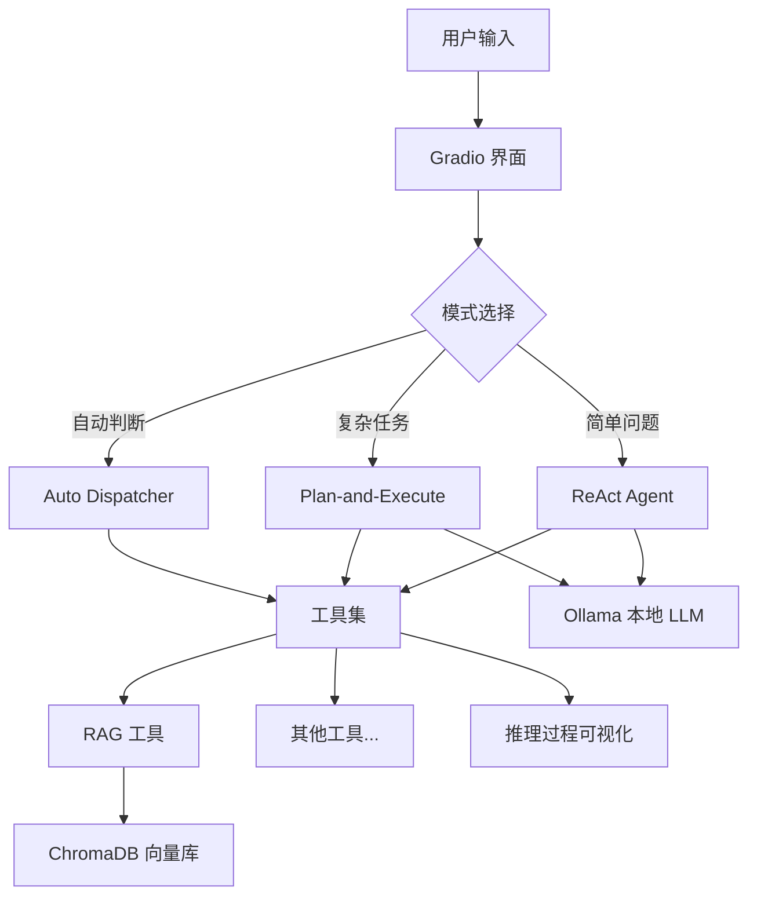

# Python 进阶课 · 综合大作业实验报告

> **填写说明**：删除所有 *斜体提示文字*，替换为你自己的内容。报告以 Markdown 格式（.md）提交。代码粘贴请控制长度，重要逻辑展示即可，完整代码在 Notebook 中。

---

## 封面信息

| 项目 | 内容 |
|------|------|
| 课程名称 | Python 进阶 |
| 姓名 | |
| 学号 | |
| 班级 | |
| 提交日期 | |
| Agent 主题 | *一句话描述你的 Agent 是做什么的* |
| 完成的扩展模块 | *勾选：A可视化 / B机器学习 / C OCR / D MCP / E多Agent / F记忆 / G HyDE / H Vibe Coding / I自定义* |

---

## 第一部分：系统设计说明

### 1.1 我的 Agent 是什么

*用 2-3 段话描述你的 Agent：*
- *它解决什么问题？服务什么用户场景？*
- *为什么选择这个主题？（真实需求、个人兴趣、技术挑战……）*
- *用一个具体的使用示例说明它的核心能力*

**一句话电梯介绍**：

> *（例："一个运行在本地的学术助手，能读取 PDF 论文，用语义检索回答问题，并在需要时自动切换为分步规划模式处理复杂的综述任务。"）*

### 1.2 系统架构图

*用 ASCII 图或 Mermaid 图展示整体架构，说明数据流向：*

```
（在此处绘制你的架构图）
```



*（以上是示例，请根据你的实际实现修改）*

### 1.3 技术选型决策

*说明以下几个关键决策，每项 2-3 句：*

**Ollama 模型选择**：（选了哪个模型，参数量，量化程度，原因——中英文能力/内存限制/任务匹配度）

**Embedding 模型选择**：（选了哪个 Embedding 模型，本地/在线，原因）

**知识库文档**：（选择了什么文档作为 RAG 的知识来源，与你的 Agent 主题如何对应）

**模式切换策略**：（Auto 模式如何判断用 ReAct 还是 Plan-and-Execute，判断依据是什么）

### 1.4 与课程知识点的对应

*填写下表，说明你的 Agent 用到了哪些课内技术：*

| 讲次 | 核心知识点 | 在大作业中的具体应用 | 对应文件/函数 |
|------|-----------|-------------------|-------------|
| 第1讲 | Pandas / 可视化 | | |
| 第2讲 | Scikit-learn | | |
| 第3讲 | Prompt 工程 / API 调用 | | |
| 第5讲 | 大模型部署 / RAG | | |
| 第6讲 | ReAct / Plan-and-Execute / LangChain | | |
| 贯穿全课 | Vibe Coding | | |

---

## 第二部分：必做任务实现报告

### Task 1：Ollama 本地 LLM 部署

#### 模型信息

| 项目 | 内容 |
|------|------|
| 模型名称 | |
| 参数量 | |
| 量化方式 | |
| 显存/内存占用 | |
| 推理速度（约 token/s） | |

#### 模型选择理由

*为什么选这个模型而不是其他？从中英文能力、内存限制、工具调用支持三个维度说明：*

#### LangChain 接入验证

*展示基础对话测试和工具调用能力验证的输出结果：*

```python
# 基础对话测试代码片段

```

**测试输出**：
```
（粘贴实际运行输出）
```

**工具调用能力验证**（Function Calling 测试）：
```
（粘贴验证结果，说明该模型是否原生支持工具调用，或通过 Prompt 模拟）
```

---

### Task 2：RAG 知识检索工具

#### 2.1 知识库文档说明

| 项目 | 内容 |
|------|------|
| 文档名称 | |
| 文档类型 | PDF / TXT / MD |
| 文档规模 | 约 X 页 / X 千字 |
| 内容简介 | |
| 与 Agent 主题的关联 | |

#### 2.2 文档处理流水线

*描述从原始文档到向量库的完整步骤：*

**文本提取**：（使用了哪个库，处理了哪些格式问题——如 PDF 乱码、多栏布局等）

**分块策略对比实验**（核心部分，须完整填写）：

*选择了哪两种分块策略？用相同的测试查询对比效果：*

**测试查询**：`（填写你的测试问题）`

| 对比维度 | 策略 1：固定大小切分 | 策略 2：递归字符切分 |
|---------|-------------------|-------------------|
| chunk_size | | |
| overlap | | |
| 总块数 | | |
| Top-1 检索片段 | （粘贴检索到的文本） | （粘贴检索到的文本） |
| 片段是否包含答案 | 是 / 否 | 是 / 否 |
| 片段是否完整（没有截断关键语句） | 是 / 否 | 是 / 否 |

**结论**：（哪种策略效果更好，原因是什么）

**Embedding 模型**：（选用了哪个，维度，本地/在线，原因）

**向量库**：ChromaDB，持久化目录：`data/chroma_db/`

#### 2.3 RAG 问答实现

**关键代码**（rag_tool 核心逻辑，约 20-30 行）：

```python
def rag_tool(query: str) -> str:
    # 粘贴核心实现代码

```

**来源标注实现方式**：（说明你如何在回答中注明引用了哪个文档片段）

#### 2.4 检索质量评估

*对以下 5 个问题进行测试，记录结果：*

| # | 测试问题 | 预期答案要点 | 实际回答是否包含要点 | Top-1 检索片段（前 50 字） | 评价 |
|---|---------|------------|-------------------|------------------------|------|
| 1 | | | 是/部分/否 | | |
| 2 | | | | | |
| 3 | | | | | |
| 4 | | | | | |
| 5 | | | | | |

**准确率**：（包含预期要点的问题数 / 5）= `X/5`

**主要失败原因**：（分析哪类问题容易检索失败，原因是什么）

#### 2.5 遇到的问题与解决

*描述至少 1 个实际遇到的技术问题和解决过程：*

- **问题**：
- **原因分析**：
- **解决方法**：
- **结果**：

---

### Task 3：Prompt 工程设计

#### 3.1 System Prompt（完整版本）

```markdown
（粘贴你最终使用的 System Prompt 完整内容）
```

**设计说明**：

| Prompt 组成部分 | 内容摘要 | 这样设计的理由 |
|---------------|---------|-------------|
| 角色定义 | | |
| 任务拆解规则 | | |
| 工具调用规范 | | |
| 输出格式约束 | | |

#### 3.2 工具描述 Prompt 对比

*展示你的每个工具的"差版本"和"好版本"描述，以及对 Agent 行为的影响：*

**工具 1：rag_tool**

差版本：
```
description="搜索文档"
```

好版本：
```
description="（填写你设计的工具描述）"
```

**对比实验结果**：

| 测试指令 | 使用差版本时 Agent 的行为 | 使用好版本时 Agent 的行为 |
|---------|----------------------|----------------------|
| *（填写测试指令）* | （是否正确调用了工具？） | （是否正确调用了工具？） |

**工具 2：（你的第二个工具名）**

（同上格式）

#### 3.3 输出格式约束实验

**测试问题**：`（填写你用于对比的问题）`

| 约束风格 | Prompt 内容 | Agent 输出（前 100 字） | 格式符合度 | 适用场景 |
|---------|-----------|----------------------|---------|---------|
| 无约束 | （直接提问） | | | |
| 自然语言约束 | "请以要点列表形式回答..." | | | |
| JSON 结构约束 | "以 JSON 返回，字段：answer, source, confidence" | | | |

**结论**：（哪种约束风格最适合你的 Agent 场景，原因是什么）

---

### Task 4：双模式 Agent 引擎

#### 4.1 ReAct 模式实现

**工具注册方式**（核心代码）：

```python
from langchain.tools import Tool
from langchain.agents import create_react_agent, AgentExecutor

tools = [
    Tool(name="rag_tool", func=rag_tool, description="..."),
    # 其他工具...
]

react_executor = AgentExecutor(
    agent=react_agent,
    tools=tools,
    verbose=True,
    return_intermediate_steps=True,
    max_iterations=8,
)
```

**ReAct 推理过程示例**（展示一次完整的工具调用链）：

```
用户输入：（填写你的测试问题）

[Step 1]
  Thought: 
  Action: 
  Action Input: 
  Observation: 

[Step 2]
  Thought: 
  Action: 
  Action Input: 
  Observation: 

Final Answer: 
```

**ReAct 适合的任务类型**：（根据你的测试，总结 ReAct 模式在哪类问题上表现好）

#### 4.2 Plan-and-Execute 模式实现

**Planner 实现方式**：（使用 langchain_experimental 的 load_chat_planner，还是自己写 Prompt 让 LLM 输出计划列表？说明选择理由）

**Plan-and-Execute 推理过程示例**：

```
用户输入：（填写一个复杂的多步骤任务）

═══ Planning Phase ═══
Generated Plan:
  Step 1: 
  Step 2: 
  Step 3: 

═══ Execution Phase ═══

[Executing Step 1]
  Tool: 
  Input: 
  Output: 
  Status: ✅ 完成

[Executing Step 2]
  Tool: 
  Input: 
  Output: 
  Status: ✅ 完成

[Executing Step 3]
  ...

Final Answer: 
```

**Plan-and-Execute 适合的任务类型**：

#### 4.3 Auto 模式（模式自动切换）

**判断逻辑**：（说明你的自动判断器如何区分"简单问题"和"复杂任务"）

```python
def auto_dispatch(user_input: str) -> str:
    # 粘贴判断逻辑核心代码

```

**切换测试记录**：

| 输入问题 | 系统判断结果 | 实际适合模式 | 判断是否正确 |
|---------|-----------|-----------|-----------|
| | ReAct / P&E | | 是/否 |
| | | | |
| | | | |

**误判案例分析**（若有）：（哪条输入判断错了，原因是什么，如何改进）

#### 4.4 推理过程可视化

**实现方式**：（说明如何在 Gradio 中展示推理链——使用 `return_intermediate_steps`？自定义 callback？流式输出？）

**Gradio 界面截图**：

``

**界面组件说明**：

| 组件 | 类型 | 功能 |
|------|------|------|
| | gr.Textbox | |
| | gr.Radio | 模式切换（ReAct / P&E / Auto） |
| | | 推理过程展示 |
| | | 最终答案展示 |

---

## 第三部分：扩展功能报告

*仅填写你实际完成的扩展项，删除其余部分。*

---

### 扩展 A：数据可视化工具（若完成）

**支持的图表类型**：（列出实现的图表类型）

**visualization_tool 核心代码**：

```python
# 粘贴核心实现，约 20 行

```

**图表效果展示**：

| 图表类型 | 数据来源 | 分析意图 | 图片 |
|---------|---------|---------|------|
| 折线图 | | | `` |
| 柱状图 | | | `` |
| 散点图 | | | `` |

**Agent 调用验证**：

```
用户指令：（填写）
Agent Action: visualization_tool
Action Input: {...}
Observation: 图表已保存至 output/...
```

---

### 扩展 B：机器学习建模工具（若完成）

**实现的算法**：（列出两种算法）

**算法 1**：（名称、数据集、关键指标）

| 指标 | 数值 | 解读 |
|------|------|------|
| | | |

``

**算法 2**：（名称、数据集、关键指标）

``

**Agent 调用验证**：

```
用户指令：（填写）
Agent Thought: 用户需要聚类分析，应调用 kmeans_tool...
Agent Action: kmeans_tool
Observation: 聚类完成，轮廓系数 0.62...
```

---

### 扩展 C：OCR 图像识别工具（若完成）

**使用的 OCR 库**：

**测试图片说明**：（来源、内容类型——纯文本/表格/混合）

**识别结果**：

```
（粘贴原始识别文本）
```

**结构化结果**（若包含表格）：

| 列1 | 列2 | 列3 |
|----|----|----|
| | | |

**后处理逻辑说明**：（如何清洗识别噪声、修正常见误识别）

---

### 扩展 D：MCP 工具集成（若完成）

**集成的 MCP 服务器**：（名称、功能、选择理由）

**接入代码核心片段**：

```python
# 粘贴 MCP 客户端初始化和工具注册代码

```

**MCP 工具调用示例**：

```
用户指令：（填写触发 MCP 工具的指令）
Agent Action: [MCP 工具名]
Observation: （MCP 返回结果）
```

**与本地工具混合调用示例**：

```
（展示一次 Agent 同时调用了 MCP 工具和本地工具的完整推理链）
```

---

### 扩展 E：多 Agent 协作（若完成）

**架构设计图**：


**各 Agent 角色分工**：

| Agent 名称 | 职责 | 拥有的工具 |
|-----------|------|---------|
| 协调 Agent | | |
| 专家 Agent 1 | | |
| ... | | |

**协作示例**（一次完整的多 Agent 交互过程）：

```
用户 → 协调 Agent: （输入任务）
协调 Agent: 我需要将任务分解...
协调 Agent → 专家 Agent 1: （子任务 1）
专家 Agent 1: （执行并返回结果）
协调 Agent → 专家 Agent 2: （子任务 2）
...
协调 Agent → 用户: （综合回答）
```

**与单 Agent 方案的对比**：（在哪类任务上多 Agent 有优势，有什么额外开销）

---

### 扩展 F：Agent 记忆系统（若完成）

**实现的记忆类型**：

- [ ] 短期记忆（对话历史）
- [ ] 长期记忆（跨对话持久化）

**实现方案说明**：（使用 ConversationSummaryBufferMemory 还是自定义？如何持久化？）

**跨对话记忆验证**：

```
[第一次对话]
用户：我叫张三，我对机器学习感兴趣
Agent：好的，记住了...

[重启 Agent 后的第二次对话]
用户：你还记得我吗？
Agent：（是否成功回忆起第一次对话的内容？）
```

---

### 扩展 G：HyDE 高级检索（若完成）

**HyDE 实现逻辑**：

```python
def hyde_rag_tool(query: str) -> str:
    # 步骤 1：让 LLM 生成假设答案
    # 步骤 2：用假设答案的向量检索真实文档
    # 步骤 3：用真实检索结果回答原始问题

```

**标准检索 vs HyDE 效果对比**：

| 测试问题 | 标准检索 Top-1 片段 | HyDE 检索 Top-1 片段 | 哪个更好 | 原因 |
|---------|------------------|-------------------|---------|------|
| Q1 | | | | |
| Q2 | | | | |
| Q3 | | | | |

**结论**：（HyDE 在哪类问题上改善明显，有什么局限）

---

### 扩展 H：Vibe Coding 全流程记录（若完成）

#### 使用的 AI 工具

| 工具 | 用于哪些功能开发 | 使用频率 |
|------|---------------|---------|
| CodeBuddy | | 高/中/低 |
| Cursor / 其他 | | |

#### 关键开发对话（5 段截图）

**截图 1**：*（说明这段对话的背景：你在解决什么问题，AI 给出了什么，效果如何）*

``

**截图 2**：

``

**截图 3**：

``

**截图 4**：

``

**截图 5**：

``

#### 我的高效 Prompt 模板（至少 3 个）

**模板 1**：功能—— *（描述这个 Prompt 的用途）*

```
你是一个 [角色]，正在帮我 [任务]。
约束条件：
- [约束 1]
- [约束 2]
输出格式：[格式要求]

我的具体需求：[具体内容]
```

**模板 2**：

```
（填写）
```

**模板 3**：

```
（填写）
```

#### Vibe Coding 效率自评

| 功能模块 | AI 贡献程度 | 迭代次数 | 最大挑战 |
|---------|-----------|---------|---------|
| RAG 工具 | 高/中/低 | | |
| ReAct 集成 | | | |
| Plan-and-Execute | | | |
| Gradio 界面 | | | |
| 其他... | | | |

**总结**：（Vibe Coding 在哪些环节最省力？哪些地方 AI 生成的代码有明显缺陷？你是如何发现并修正的？）

---

### 扩展 I：自定义扩展（若完成）

**功能名称**：

**解决的问题**：（这个功能给 Agent 带来了什么价值）

**技术实现方式**：

**效果展示**：

---

## 第四部分：总结与反思

### 4.1 功能完成情况自评

**必做部分**：

| Task | 完成程度 | 自评分 | 亮点或不足 |
|------|---------|-------|----------|
| Task 1：Ollama 部署 | 完全/部分/未完成 | /10 | |
| Task 2：RAG 知识检索 | | /20 | |
| Task 3：Prompt 工程 | | /10 | |
| Task 4：双模式 Agent | | /40 | |
| **必做合计** | | **/80** | |

**扩展部分**：

| 扩展项 | 自评分 | 简述 |
|--------|-------|------|
| | | |
| | | |
| **扩展合计** | **/30（上限）** | |

**预计总分（折算前）**：`___/110`

### 4.2 ReAct vs Plan-and-Execute 的使用体会

*这是本大作业最核心的反思问题，请认真填写（200 字以内）：*

- 在你的 Agent 中，ReAct 表现最好的场景是什么？
- Plan-and-Execute 什么时候比 ReAct 明显更好？
- Auto 模式的判断逻辑是否足够准确？如果可以改进，你会怎么做？
- 你认为这两种范式在工程落地中各自的主要局限是什么？

### 4.3 RAG 系统最大的技术挑战

*描述你在构建 RAG 系统时遇到的最难解决的问题（150 字以内）：*

### 4.4 如果再给一周

*如果时间充裕，你最想继续改进哪个部分？具体说明改进方向（100 字以内）：*

### 4.5 课程学习收获

*完成大作业后，回顾整个课程：*

- **最意外的收获**：（某个知识点比预期更有用？Vibe Coding 改变了什么习惯？）
- **希望更深入的主题**：（哪个技术点希望课程讲得更深？）
- **一个给未来学弟学妹的建议**：（如果你来重新设计大作业，会加什么要求？）

### 4.6 参考资料

*按格式列出参考资料（不少于 3 条）：*

1. LangChain 官方文档：https://python.langchain.com/
2. Ollama 官网：https://ollama.ai/
3. （其他参考资料）

---

> **字数建议**：报告正文（不含代码块）1500-3000 字。代码展示聚焦核心逻辑，完整实现在 Notebook 中。
